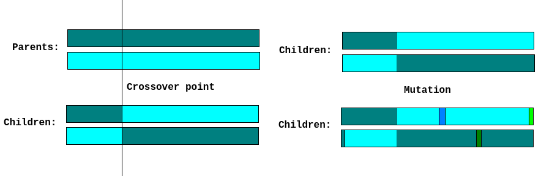
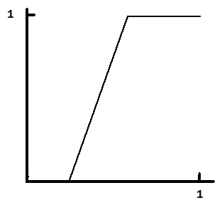
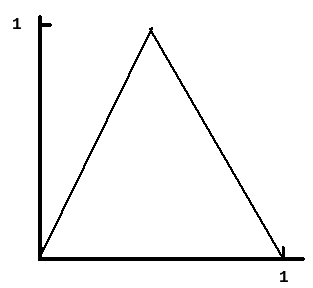
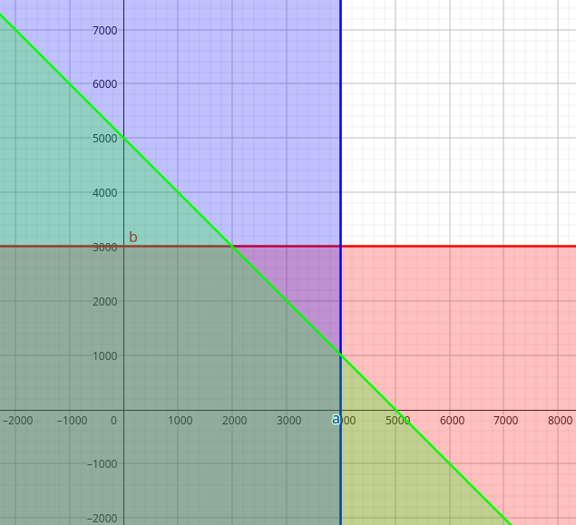
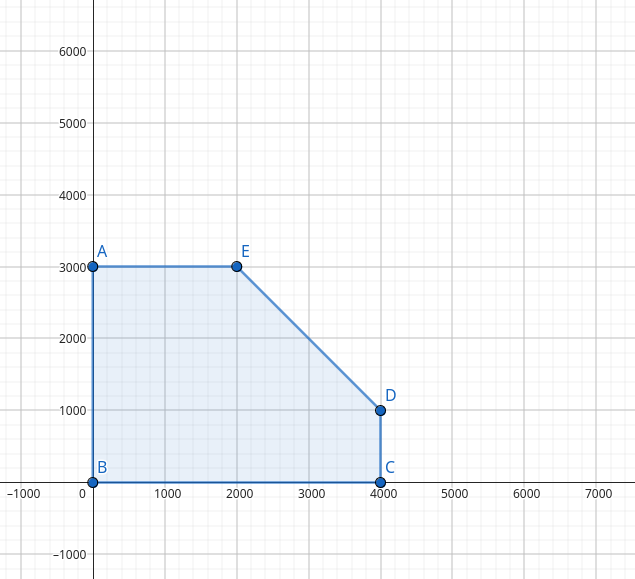
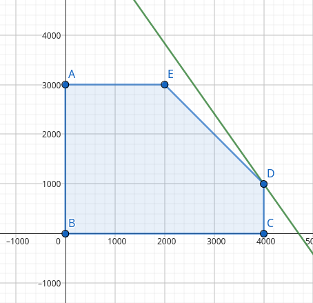
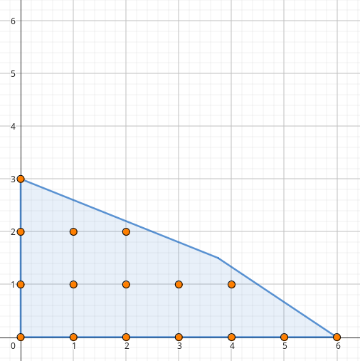
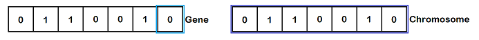
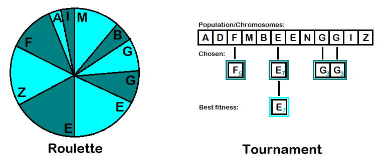
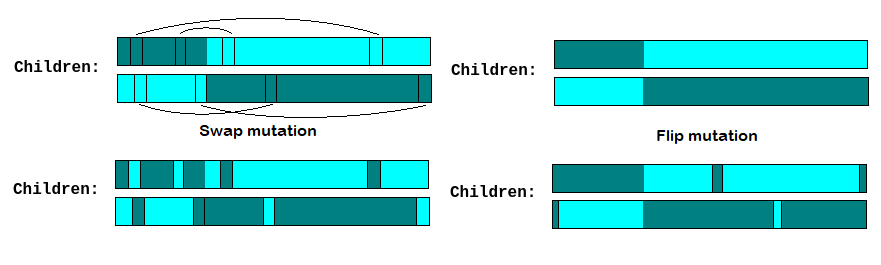

# 1. Uvod
## 1.1 Napredni alati:
 1. **Deskriptivni alati:** 
Fokusiraju se na analizu onoga što se već dogodilo ili šta se trenutno dešava. Izveštavaju i daju uvid u prošle i trenutne performanse sistema ili poslovanja. Primeri uključuju analize prodaje u prethodnim kvartalima, podatke o prometu na web stranicama, ili izveštaje o korisničkom zadovoljstvu.

 2. **Prediktivni alati:**
Koriste statističke tehnike i algoritme mašinskog učenja za predviđanje budućih događaja ili ponašanja na osnovu istorijskih podataka. Na primer, predviđanje potražnje za proizvodima, prognoze vremenskih uslova, ili predviđanje kvarova na mašinama.

 3. **Preskriptivni alati:** 
Ovi alati idu korak dalje od predikcije jer ne samo da govore šta će se dogoditi, već i sugerišu šta treba preduzeti kako bi se postigli željeni rezultati. Oni koriste optimizacione algoritme i simulacije kako bi preporučili najbolje akcije ili odluke, npr. optimizacija zaliha u trgovini ili kreiranje efikasnih ruta za dostavu.

## 1.2 Mašinsko učenje:
Grana veštačke inteligencije koja omogućava sistemima da uče iz podataka bez eksplicitnog programiranja.\
**Prediktivna analitika** je ključna primena mašinskog učenja, jer se koristi za analizu i predviđanje budućih trendova. Ovo uključuje rad sa ogromnim količinama podataka, obično u realnom vremenu, gde se model trenira na istorijskim podacima kako bi prepoznao obrasce i pravio predviđanja.\
Kako podaci postaju zastareli, zrelost modela opada što znači da modeli postaju manje tačni i efikasni vremenom.

# 2. Paradigme u veštačkoj inteligenciji:
 
 Osnovne paradigme: 
1. Veštačke neuronske mreže (ANN)  
2. Evolutivna izračunavanja (EC) 
3. Inteligencija grupa (SI)
4. Veštački imuni sistem (AIS)
5. Rasplinuti sistemi (Fuzzy systems)

O svim paradigmama biće dodatno rečeno. Svaka od paradigmi ima svoje podparadigme zasnovane/inspirisane istim principima.

## 2.1 Veštačke neuronske mreže (ANN):
Ove mreže oponašaju način na koji ljudski mozak obrađuje informacije, koristeći veštačke neurone koji obrađuju informacije kroz slojeve. Svaki neuron prima ulazne podatke (npr. informacije iz okruženja ili drugih neurona), množi ih odgovarajućim težinama (w1, w2, w3…) i primenjuje aktivacionu funkciju kako bi odlučio da li će poslati signal i sa kojom snagom. ANN se široko koriste u oblastima kao što su prepoznavanje zvuka (npr. u glasovnim asistentima), prepoznavanje oblika (npr. u računalnoj viziji), i kontrola robota.

Ovi koncepti i alati su ključni za razumevanje savremenih tehnika veštačke inteligencije i mašinskog učenja, posebno u kontekstu njihovih praktičnih primena i sposobnosti.

## 2.2 Evolutivna izračunavanja (EC)
Evolutivna izračunavanja su metoda optimizacije zasnovana na simulaciji prirodne selekcije, gde se jedinke koje su bolje prilagođene okruženju "preživljavaju" i prenose svoje "gene" (karakteristike) na sledeće generacije. Oni koji se lošije prilagode ne prenose svoje gene, što omogućava da populacija u celini postane bolja vremenom. Rekombinacija gena preživelih jedinki stvara nova rešenja, simulirajući prirodni evolucioni proces. Na ovaj način, evolutivni algoritmi "uče" kroz generacije kako da dođu do optimalnog rešenja za zadati problem.

#### Ključni koncepti:
- **Populacija:** Skup potencijalnih rešenja (jedinki) u algoritmu.
- **Fitnes funkcija:** Funkcija koja ocenjuje koliko je svaka jedinka uspešna u rešavanju problema.
- **Selektivni pritisak:** Jedinke sa boljim karakteristikama imaju veću šansu da prenesu svoje gene na sledeće generacije.

### 2.2.1 Genetski algoritmi (GA):
Genetski algoritmi su najpoznatija forma evolutivnih izračunavanja i funkcionišu tako što predstavljaju rešenja problema kao nizove binarnih vrednosti (0 i 1), poznate kao "hromozomi". Svaki hromozom predstavlja jedan mogući način rešavanja problema. Algoritam zatim koristi operacije kao što su **rekombinacija (ukrštanje)** i **mutacija** kako bi stvorio nove jedinke (nove nizove 0 i 1) u svakoj generaciji. Ove nove jedinke se zatim testiraju pomoću fitnes funkcije, a one koje daju bolje rezultate imaju veće šanse da budu zadržane i dalje evoluiraju.

#### Ključne operacije u GA:
- **Ukrštanje (Crossover):** Dva roditeljska rešenja se kombinuju da bi se kreirala nova rešenja.
- **Mutacija:** Nasumična promena vrednosti unutar rešenja, koja obezbeđuje raznolikost i izbegava lokalne minimume.

### 2.2.2 Genetsko programiranje (GP):
Genetsko programiranje je posebna vrsta evolutivnog algoritma koja ne evoluira nizove brojeva ili binarne kodove kao u genetskim algoritmima, već evoluira **programe**. Svaki jedinka je računski program koji se optimizuje kroz generacije. Cilj je stvoriti program koji na najbolji način rešava zadati problem. Kroz generacije, GP koristi rekombinaciju, mutacije i selekciju kako bi kreirao sve efikasnije programe.

#### Glavne karakteristike GP:
- Evoluira se **struktura programa**.
- Može se koristiti za automatizovano generisanje koda, kreiranje strategija ili predikcionih modela.
- Primene uključuju dizajn algoritama, modeliranje i predikciju, kao i automatizaciju zadataka.

### 2.2.3 Evolutivno programiranje (EP):
Evolutivno programiranje se razlikuje od genetskih algoritama po tome što se ne fokusira na rekombinaciju gena, već se promene vrše na individualnim jedinkama kroz stohastičke mutacije. U EP, populacija je skup rešenja koja se optimizuju kroz promenu pojedinih karakteristika (članova niza) rešenja. Cilj EP je pronaći optimalno rešenje kroz iterativno prilagođavanje rešenja bez direktne rekombinacije.

#### Ključne karakteristike EP:
- Promene su stohastičke i odnose se na pojedinačne elemente niza.
- Fokus je na mutaciji i evoluciji kroz generacije.
- Koristi se u rešavanju problema optimizacije i modeliranja složenih sistema.

### 2.2.4 Koevolucija:
Koevolucija opisuje proces u kojem različite populacije evoluiraju u međusobnoj interakciji. Ovo znači da evolucija jedne populacije zavisi od evolucije druge. Primer su predatori i plen u prirodi: kako plen postaje brži i spretniji, tako predatori moraju evoluirati da bi ih i dalje hvatali. U kontekstu algoritama, to može uključivati "parazite" ili ometajuće faktore koji usporavaju ili komplikuju evolucioni proces, čineći zadatak težim za optimizaciju.

#### Ključne karakteristike koevolucije:
- Evolucija se dešava u međusobno zavisnim populacijama.
- "Paraziti" mogu ometati ili izazivati osnovnu populaciju da se prilagođava.
- Koristi se u problemima gde postoji višestruka interakcija između različitih elemenata, kao što su igre sa više igrača, tržišne simulacije, ili optimizacija mreža.

### 2.2.5 Koristi evolutivnih izračunavanja:
#### Evolutivna izračunavanja se najčešće koriste kada:

1. **Ne postoji deterministički algoritam** koji može u prihvatljivom vremenu dati rešenje za problem. Na primer, složeni problemi optimizacije ili NP-teški problemi ne mogu se efikasno rešiti determinističkim algoritmima.
2. **Klasifikacija podataka** je potrebna, mada mašinsko učenje često nudi bolja rešenja za ove zadatke. Ipak, evolutivni algoritmi mogu biti korisni kada je problem specifičan ili ne može lako da se modelira korišćenjem tradicionalnih tehnika mašinskog učenja. 

Evolutivni algoritmi pružaju fleksibilnost i mogu istraživati veliki prostor rešenja, često pronalazeći neintuitivna, ali efikasna rešenja za složene probleme.

## 2.3 Inteligencija grupa (Swarm Intelligence - SI):
Odnosi se na sposobnost grupa organizama, poput ptica, mrava ili pčela, da pokažu složeno ponašanje kroz jednostavne individualne interakcije. Ovi organizmi funkcionišu prema pravilima kolektivnog ponašanja, gde svaka jedinka donosi jednostavne odluke, ali zajedno postižu inteligentne rezultate bez centralizovane kontrole. U domenu veštačke inteligencije, SI se koristi za optimizaciju i rešavanje složenih problema, imitirajući ovu vrstu grupne koordinacije.

### 2.3.1 PSO (Particle Swarm Optimization):
PSO je metoda optimizacije koja se zasniva na kolektivnom ponašanju jata ptica. U ovom algoritmu, ptice (ili čestice) se kreću kroz višedimenzioni prostor podataka, tražeći optimalno rešenje problema. Svaka čestica u PSO algoritmu prilagođava svoju poziciju na osnovu sopstvenog iskustva i iskustva drugih čestica iz jata. Kako se ptice kreću kroz prostor, privlače jedna drugu ka boljim rešenjima, pa su veće šanse da će se kretati ka optimalnom rešenju. Na sličan način funkcionišu i algoritmi zasnovani na ponašanju mrava (ACO - Ant Colony Optimization), gde mravi tragaju za optimalnim rešenjem problema zasnovanim na lokalnim interakcijama i ponašanju grupe.

## 2.4 Rasplinuti (fuzzy) sistemi: 
Ovo su sistemi koji mogu raditi sa nejasnim, nepotpunim ili dvosmislenim informacijama. 
Umesto da koriste striktna pravila kao klasični sistemi, rasplinuti sistemi omogućavaju "sive zone", gde se odluke donose na osnovu verovatnoće ili približnih vrednosti.
Logika nije strogo binarna (0 ili 1), već vrednosti mogu biti između 0.0 i 1.0. U ovim sistemima, odluke se donose na osnovu stepena pripadnosti određenim skupovima, što omogućava fino podešavanje odluka i ponašanja u situacijama koje nisu strogo definisane. 

| S                               | Trapez                               | Trougao                                |
| ------------------------------- | ------------------------------------ | -------------------------------------- |
|  |  |  |

Fazi logika dozvoljava rad sa nepreciznim, nejasnim ili nepotpunim informacijama, simulirajući ljudsko rasuđivanje u takvim uslovima. Koriste se u oblasti kontrole, kao što su pametni termostati ili sistemi za navigaciju.

# 3. Veliki jezički modeli (LLM): 
Složeni algoritmi zasnovani na ANN, kao što su chat roboti, koji su trenirani na velikim količinama podataka kako bi mogli da razumeju i odgovaraju na pitanja u prirodnom jeziku. Ovi modeli koriste prethodno analizirane i ispitane podatke, i primenjuju se u specifičnim, užim domenima, ali su dovoljno fleksibilni da odgovaraju na različite upite u okviru svog znanja. Velika baza podataka omogućava im da analiziraju i razumeju pitanja, a zatim generišu odgovore koristeći tehnike generisanja prirodnog jezika (NLG - Natural Language Generation).

#### Način rada LLM-a:
1. **Analiza podataka pomoću dubokog učenja:** Ovaj proces uključuje obradu i razumevanje velikih količina podataka kako bi LLM model mogao da nauči zakonitosti ljudskog jezika.

2. **Generisanje odgovora na osnovu podataka (NLG):** Nakon što LLM razume pitanje, koristi svoju bazu znanja da generiše koherentan i relevantan odgovor.

#### Proces pravljenja LLM-a:

1. **Priprema:** U ovoj fazi vrši se tokenizacija (razbijanje teksta na manje delove ili tokene), uzorkovanje podataka i umetanje tokena koji su relevantni za dalje učenje modela.
2. **Mehanizam pažnje (attention mechanism):** Fokusira se na specifične delove ulaznih podataka kako bi generisao specifične delove izlaznih odgovora, omogućavajući modelu da efikasnije procesira relevantne informacije. Dve popularne kategorije su **instruction** i **classification** fine-tuning.
    - **Instruction fine-tuning** : podaci sadrže instrukcije i već predodređena rešenja.
    - **Classification fine-tuning** : podaci su označeni sa klasom koju treba da asociraju (npr. mejlovi koji su asocirani sa "spam" i "not spam") 
3. **Arhitektura LLM-a:** Sve informacije se kombinuju u koherentnu strukturu koja omogućava modelu da obavlja zadatke učenja i generisanja odgovora.
4. **Prethodno treniranje i treniranje:** Model se inicijalno trenira od nule koristeći velike skupove podataka, gde uči osnovne jezičke strukture i zakonitosti.
5. **Fino obučavanje:** Nakon inicijalnog treniranja, model se dodatno usavršava na specifičnim skupovima podataka, kako bi bio prilagođen za određene domene i zadatke (na primer, pravni savetnici, medicinski asistenti).

## 3.1 Transformer arhitektura:
Većina LLM-ova se oslanja na transformer arhitekturu, NNA predstavljen 2017, prvo korišćen za mehanizam prevođenja engleskog teksta u tekst na nemačkom ili francuskom. \
Sastavljen iz dva modula:\
	- **enkoder**: procesuira uneti tekst i predstavlja ga u vidi vektora sa numeričkim vrednostima koji predstavlja kontekst teksta.\
	- **dekoder**: vektor enkodera se daje dekoderu koji dekodira dobijeni vektor i gradi rečenicu u izabranom jeziku.

Izgrađeni na ovom konceptu su:

**BERT** (bidirectional encoder representations from transformer) - pronalazi sakrivene/maskirane reči u tekstu. (korišćen je na Twitteru za pronalaženje neprikladnih postova)\
**GPT** (generative pretrained transformers) - generiše tekst (prevođenje, pisanje koda, dovršavanje rečenica...), trenirani da predpostave sledeću reč na osnovu već ispisanih reči...

LLM i transformer se danas tretiraju kao sinonimi usled velike zasnovanosti LLM-a na arhitekturi transformera.
 
## 3.2 Ograničenja LLM-a:

1. **Razumevanje konteksta:** Iako LLM-ovi mogu obrađivati veliki broj informacija, često imaju poteškoće sa dubljim razumevanjem konteksta ili složenih apstraktnih veza.
2. **Pristrasnost:** LLM modeli su često pristrasni jer se oslanjaju na podatke na kojima su trenirani. Ako ti podaci sadrže pristrasnost, i sam model će ih reflektovati.
3. **Zdrav razum:** Iako mogu simulirati razumevanje jezika, LLM-ovi nemaju zdrav razum kakav ljudi poseduju, što znači da mogu generisati odgovore koji su logički tačni, ali nemaju smisla u realnim situacijama.
4. **Etika: (iz predhodne tri tačke)** Odluke i odgovori koje generišu LLM modeli zavise od podataka na kojima su obučeni, što može voditi do etičkih dilema, kao što su širenje netačnih informacija ili diskriminatornih stavova.

# 4. Optimizacioni algoritmi: 
Specifična vrsta algoritama koji pripadaju grupi pretrage, a njihov glavni cilj je da pronađu optimalno rešenje za datu ciljnu funkciju, koja može biti minimizacija ili maksimizacija, uz određeni skup ograničenja.

## 4.1 Osnovni pojmovi:
**Funkcija cilja:** Ovo je funkcija koja mapira prostor rešenja (S) u realne brojeve (R). Oblik funkcije može biti (f: S -> R). Kada se govori o minimizaciji, cilj je pronaći takvu vrednost **x** da je f(x) minimalna. U isto vreme, maksimizacija funkcije f može se izraziti kao minimizacija njene negacije, tj. (-f). Ovde **x** predstavlja nezavisne promenljive koje utiču na vrednost funkcije cilja.
**Skup ograničenja:** Ovaj skup definiše zavisnosti između nezavisnih promenljivih. Ograničenja mogu biti postavljena na način da definišu dozvoljene vrednosti za promenljive, kao i odnose među njima. Ograničenja mogu biti zasnovana na jednakostima (npr. $g(x) = 0$) i/ili nejednakostima (npr. $h(x) \leq 0$).

**Globalni minimum** je najmanja vrednost funkcije u celokupnom prostoru rešenja. 
**Lokalni minimumi** su minimalne vrednosti funkcije unutar određenih područja prostora rešenja. 

U mnogim slučajevima, algoritmi optimizacije mogu naići na lokalne minimume koji nisu globalni, što može otežati postizanje optimalnog rešenja.

## 4.2 Optimizacione metode:
Optimizacione metode imaju za cilj da pronađu optimum u prostoru dozvoljenih rešenja. Rešenja su dozvoljena ako su zadovoljena postavljena ograničenja. 

**Klasifikacija metoda:**
1. **Pretraga:** Metode se mogu deliti na **lokalne** i **globalne** metode pretrage. Lokalne metode traže rešenja u blizini trenutnog rešenja, dok globalne metode pretražuju širi prostor rešenja kako bi pronašle najbolja moguća rešenja.
2. **Pristup pretrage:** Postoje **stohastičke** metode (poput Monte Karlo) koje koriste nasumične uzorke da bi istražile prostor rešenja, i **determinističke** metode koje koriste unapred definisane strategije i pravila. 
	Cesto se koriste kombinacije stohastičkog i determinističkog pristupa.

## 4.3 Ograničenja:
Ograničenja u optimizaciji mogu se primenjivati na sledeće načine:

1. **Odbacivanje:** Nedozvoljena rešenja se jednostavno odbacuju.
2. **Dodeljivanje penala:** Nedozvoljenim rešenjima se dodeljuju
kazneni bodovi, što ih čini manje atraktivnim tokom pretrage.
3. **Smanjivanje na bez ograničenja:** Rešenja se prvo optimizuju bez ograničenja, a zatim se dodaju ograničenja kako bi se izabrala dopustiva rešenja.
4. **Održavanje dopustivosti:** Tokom pretrage, održava se dopustivost rešenja tako što se stalno proveravaju ograničenja.
5. **Uređivanje dopustivih rešenja:** Metode se koriste za generisanje i održavanje skupa dopustivih rešenja.
6. **Popravljanje:** Ako se naiđe na nedozvoljeno rešenje, mogu se primeniti metode za njegovo ispravljenje kako bi postalo dozvoljeno.

## 4.4 Prostor rešenja:
Prostor rešenja u kojem se vrši optimizacija može se podeliti na:
- **Kombinatornu optimizaciju:** Ova vrsta optimizacije se bavi problemima gde je prostor rešenja diskretan (npr. raspoređivanje, putnički problem, itd.).
- **Globalnu optimizaciju:** Ova metoda se bavi problemima u kojima su rešenja kontinualna i gde se traži najbolja moguća vrednost funkcije cilja u celokupnom prostoru rešenja.

Ove klasifikacije i principi igraju ključnu ulogu u razvoju i primeni optimizacionih algoritama u različitim oblastima, uključujući inženjering, ekonomiju, operativna istraživanja i mnoge druge.

## 4.5 Kombinatorna oprimizacija:
Predstavlja oblast optimizacije koja se fokusira na probleme u kojima je prostor rešenja diskretan, a jedan od najpoznatijih primera je **problem trgovackog putnika (TSP - Traveling Salesman Problem)**. 

U ovom problemu, trgovac treba da obiđe određeni broj gradova tako da se vrati u početni grad, a cilj je minimizirati ukupnu udaljenost ili vreme putovanja.

### 4.5.1 Opšta formula algoritma pretrage:
**Dok nije zadovoljen kriterijum završetka:** 
Algoritam se nastavlja dok se ne postigne određeni cilj ili kriterijum.
1. **Izračunaj vrednost:** Prvo se izračunava vrednost funkcije cilja za trenutno rešenje.
2. **Izračunaj pravac i smer pretrage:** Na osnovu trenutne vrednosti, određuje se pravac u kojem će se nastaviti pretraga.
3. **Izračunaj dužinu koraka pretrage:** Definiše se koliko daleko se ide u odabranom pravcu.
4. **Pređi u naredno rešenje:** Na osnovu prethodnih koraka, prelazi se na sledeće rešenje u pretrazi.

### 4.5.2 Višeciljna optimizacija:
Višeciljna optimizacija se koristi kada je potrebno zadovoljiti više kriterijuma (funkcija). Ovo je posebno važno u složenim situacijama kao što su ekonomija i transportni problemi, gde se često moraju razmatrati različiti faktori, poput troškova, vremena, kapaciteta i kvaliteta usluge.

## 4.6 Pristupi rešavanju:
#### Postoje dva glavna pristupa u rešavanju višeciljnih optimizacija:
1. **Pravljenje ponderisanih proseka (agregacija):** Ovaj pristup uključuje kombinovanje više ciljeva u jednu jedinstvenu funkciju cilja putem ponderisanja, što omogućava da se različiti kriterijumi tretiraju kao jedinstveni problem. Na taj način, svaki kriterijum se množi sa svojim težinskim faktorom, a zatim se sumiraju.
2. **Pravljenje skupa Pareto-optimalnih rešenja:** Ovaj pristup identifikuje rešenja koja su optimalna u smislu Pareto efikasnosti, što znači da nijedno rešenje ne može biti poboljšano u jednom kriterijumu bez pogoršanja u drugom. Pareto-optimalna rešenja omogućavaju odlučivačima da biraju između različitih opcija u skladu sa svojim preferencama.

Ovi pristupi su ključni za uspešno rešavanje složenih problema u optimizaciji, omogućavajući analizu i donošenje odluka u situacijama gde su zahtevi višestruki i često suprotstavljeni.

## 4.7 Algoritam za rešavanje problema:
Algoritam za rešavanje problema predstavlja metod kojim dolazimo do rešenja određenog zadatka ili zadatog problema. Svaki specifičan problem koji rešavamo naziva se **instanca problema**. Na primer, problem prelaska iz tačke A do tačke B može imati različite instance u zavisnosti od specifičnih početnih i krajnjih tačaka.

### 4.7.1 Problem odlučivanja:
Problem odlučivanja je tip problema gde je cilj potvrditi ili opovrgnuti određeno svojstvo. Ovi problemi pripadaju klasi **P** (polinomijalna složenost), što znači da se mogu rešavati algoritmima koji rade u polinomijalnom vremenu u odnosu na veličinu ulaznih podataka. 

Većina problema može se svesti na oblik problema odlučivanja. Algoritmi koji rešavaju probleme u polinomijalnom vremenu smatraju se **optimalnim**, jer su vremenski efikasni i rešivi u razumnom vremenu za praktične ulaze.

### 4.7.2 Pristupi rešavanju problema:
1. **Egzaktno rešavanje:** Ovim pristupom se dolazi do garantovano optimalnog rešenja za problem. Koriste se algoritmi koji pružaju tačan odgovor, ali to može biti vremenski zahtevno za velike probleme.
2. **Približno rešavanje:** Približni algoritmi, često bazirani na (meta)heuristikama, pružaju rešenja koja nisu nužno optimalna, ali su dovoljno dobra u praksi. Ovi pristupi su korisni kada je problem previše složen za egzaktno rešavanje u razumnom vremenu (NP ili eksponencijalne slozenosti).

#### Vremenska složenost i O notacija:
Vremenska složenost algoritma opisuje kako se vreme izvršavanja algoritma menja sa veličinom ulaznih podataka. **O notacija** koristi se za izražavanje gornje granice složenosti algoritma i omogućava klasifikaciju algoritama prema njihovoj efikasnosti.

#### Eksponencijalni problemi:
Vreme izvršavanja raste eksponencijalno sa veličinom ulaznih podataka. Primer eksponencijalnog problema je „pronalazak svih razapinjajućih stabala u potpunom grafu sa n čvorova“ ili „traženje najboljeg poteza u igri šaha“. Eksponencijalni problemi su računski vrlo zahtevni i obično nisu rešivi u razumnom vremenu za velike ulaze.

#### Nedeterministički polinomski problemi (NP):
**NP problemi** su problemi za koje je moguće proveriti rešenje u polinomijalnom vremenu, ali nije jasno da li ih možemo i rešiti u polinomijalnom vremenu za svaki slučaj. Za takve probleme nije poznato da li se mogu tačno rešiti u polinomijalnom vremenu.

### 4.7.3 Redukcija problema:
**Redukcija** se koristi za prevođenje problema na poznati oblik radi lakšeg rešavanja. Na primer, imamo problem $A_1$ za koji postoji poznat algoritam, dok problem $A_2$ predstavlja novi problem koji treba rešiti. Ako možemo prevesti problem $A_2$ u problem $A_1$ (koji već znamo da rešavamo), tada se problem $A_2$ može rešavati algoritmom za $A_1$.

### 4.7.4 NP-potpunost:
**NP-potpuni problemi** su specifični NP problemi za koje važi da, ako možemo napraviti algoritam koji ih rešava u polinomijalnom vremenu (P složenosti), svi NP problemi mogu se rešiti u polinomijalnom vremenu (ovo najverovatnije nije moguce, neki smatraju da su klase P i NP odvojene klase). NP-potpuni problemi su istovremeno najteži problemi u NP klasi i sinonim za NP-teške probleme.

## 4.8 Optimizacija:
Optimizacija se odnosi na proces pronalaženja najboljeg rešenja za zadati problem u prostoru mogućih rešenja. Glavni cilj optimizacije je minimizacija ili maksimizacija određene funkcije cilja, a razlikuju se lokalna i globalna optimizacija.

### Lokalna optimizacija:
**Lokalna optimizacija** se fokusira na pronalaženje najboljeg rešenja u neposrednom okruženju trenutnog rešenja, često nazivano **lokalni minimum**.\
Nedostatak ovog pristupa je to što, čak i ako dođemo do lokalnog minimuma, možda ćemo propustiti bolje, globalno rešenje.

Načina za proširenje pretrage:

- **Povećanje koraka pretrage** – iako može pomoći u pronalaženju boljih rešenja, ne garantuje pronalazak globalnog minimuma.
- **Nasumično ispitivanje tačaka** – nasumičnim pokušajima, tokom dugog trajanja pretrage, povećava se verovatnoća da ćemo pronaći globalni minimum.

### Metaheuristike:
Predstavljaju skup opštih metoda koje pružaju okvir za rešavanje optimizacionih problema, često na osnovu stohastičnih, odnosno nasumičnih, procesa. One su korisne kada nemamo precizne informacije o optimalnom rešenju. Uglavnom se baziraju na „slabim“ pretpostavkama ili čak na odsustvu pretpostavki o problemu, čineći ih fleksibilnim za različite primene.

### Penjanje uzbrdo:
**Penjanje uzbrdo** (eng. Hill Climbing) je tehnika koja se zasniva na **gradijentnom kretanju**. 

Postupak je sledeći:
1. Počnemo sa nekom vrednošću (rešenjem).
2. Odredimo kvalitet tog rešenja pomoću fitnes funkcije.
3. Blago promenimo početno rešenje, prelazeći u novu iteraciju, i uporedimo rezultate. Ako je novo rešenje bolje, usvajamo ga kao polaznu tačku za sledeću iteraciju.

### Intenzifikacija i diverzifikacija:
- **Intenzifikacija (exploitation)** – fokusiramo se na pretragu u blizini trenutnog dobrog rešenja, oslanjajući se na postojeća dobra rešenja kako bismo dobili stabilne rezultate.
- **Diverzifikacija (exploration)** – povremeno skrećemo sa utvrđenog puta kako bismo istražili nova rešenja i eventualno otkrili bolje mogućnosti, postižmo izabiranjem lošijeg rešenja.

### Single-State globalna optimizacija:
Uključuje niz koraka za pronalaženje najboljeg mogućeg rešenja iz globalne perspektive, tj. uzimajući u obzir ceo prostor mogućih rešenja.

1. **Selection (Izbor)** – biranje trenutnog rešenja kao početne tačke.
2. **Jump to Something New (Prelazak na novo)** – prelazak u različite oblasti prostora rešenja, omogućavajući izbegavanje lokalnih minimuma.
3. **Use a Large Sample (Korišćenje velikog uzorka)** – istraživanje većeg broja mogućih rešenja kako bi se povećala šansa za pronalaženje globalnog optimuma.

# 5. Grafovi:

**Graf** je matematička struktura koja se koristi za modeliranje odnosa između objekata. 

Sastoji se od osnovnih komponenti:

1. **Čvorovi (vertices)** – predstavljaju entitete u grafu (gradovi).
2. **Grane (edges)** – povezuju čvorove, označavajući odnos između njih (putevi izmedju gradova).

**Put** – niz grana koji povezuje jedan čvor sa drugim.\
**Ciklus** – put koji počinje i završava u istom čvoru, čineći zatvorenu petlju.\
**Brojčani stepen čvora** – broj grana koje izlaze iz određenog čvora.\
**Izolovani čvor** – čvor koji nije povezan sa nijednim drugim čvorom.\
**Susedi** – čvorovi koji su direktno povezani sa nekim čvorom putem grana.\
**Ekscentričnost čvora** - meri najveću udaljenost (broj grana) do bilo kojeg drugog čvora u grafu. Ovo može biti korisno u analizi mreža kako bi se identifikovali najudaljeniji čvorovi od određenih polaznih tačaka.\
**Komponente povezanosti** - su podgrafovi unutar grafa gde su svi čvorovi međusobno povezani, dok su čvorovi iz različitih komponenti odvojeni jedni od drugih jednom granom. Ovo je ključno u analizi mreža, jer ukazuje na različite grupe unutar strukture grafa.

Grafovi su primenljivi u različitim oblastima, kao što su **lingvistika** (analiza strukture rečenica), **informatika**, **biologija** (analiza odnosa u genomima), i **društvene mreže** (modeliranje povezanosti korisnika).

## 5.1 Multigraf:
**Multigraf** je tip grafa koji sadrži **paralelne grane**, odnosno više grana između istih parova čvorova. Koristi se kada su moguće različite veze između istih entiteta (npr. različiti putevi između dva grada)

## 5.2 Težinski i netežinski grafovi:
1. **Težinski grafovi** – svaka grana ima pridruženu vrednost ili težinu. (može predstavljati udaljenost, trošak, vreme, itd.)
2. **Netežinski grafovi** – grane nemaju težinu. Važno je samo da povezuju čvorove, ne koliko su te veze „teške“ ili „skupe“.

## 5.3 Usmereni grafovi:
**Usmereni grafovi** su grafovi u kojima svaka grana ima definisan pravac, tj. vodi od jednog čvora ka drugom, poput jednosmernih ulica u saobraćajnim mrežama. U usmerenim grafovima mogu postojati grane koje su dvosmerne.

## 5.4 Drvo:
**Drvo** je specijalna vrsta grafa koja ima sve čvorove povezane tako da ne sadrži cikluse. Sastoji se od čvorova i grana i karakteriše se time što postoji tačno jedan put između svakih parova čvorova. Drveće se često koristi u informatici za organizaciju podataka (npr. u pretraživačkim algoritmima) jer omogućava strukturu sa efikasnim pretragama i manipulacijama podacima.

# 6. Linearno programiranje (LP):
**Linearno programiranje (LP)** predstavlja optimizaciju linearne funkcije sa ograničenjima koja su izražena kao nejednakosti. Na primer, farmer ima ograničene resurse za sadnju povrća, linearno programiranje može mu pomoći da maksimizira profit unutar tih ograničenja.

## 6.1 Pogodan region (Feasible Region):
Pogodan region predstavlja prostor rešenja dobijen presecima ograničenja, koji čine prostor u kojem pretražujemo optimalna rešenja. Kod problema sa više promenljivih, ovaj prostor se nalazi u višedimenzionalnom prostoru. Minimalna ili maksimalna vrednost ciljne funkcije će se sigurno naći u nekoj od graničnih tačaka ovog regiona, kao što su teme, ivice ili stranice.

## 6.2 Geometrijski princip rešavanja:
Za pronalaženje optimalnog rešenja linearna funkcija (npr. ( ax + by = c )) se "pomeranjem" kroz pogodan region (menjanjem vrednosti konstante ( c )) postavlja u najvišu ili najnižu tačku gde dotiče region. Kada funkcija prestane da se pomera unutar ovog prostora, dostigli smo optimalno rešenje.

| Svi uslovi                           | Dobijen pogodni region                  |
| ------------------------------------ | --------------------------------------- |
|  |  |

Plavo predstavlja ograničenje količine šargarepa, crveno ogranićenje krompira, zeleno da njihov zbir ne prelazi 5000.

Na slici vidimo da je zapravo pogodan region bas presek ove tri boje, racunajuci samo ono u pozitivnom delu.

| Min                       | Mid                       | Max                       |
| ------------------------- | ------------------------- | ------------------------- |
|  |  |  |

Pomeranjem funkcije ax + by = c, uvećavanjem konstante c nalazimo maksimum. Minimalno rešenje za c = 0, a maksimum za c = 8000.

Međutim, geometrijski pristup nije efikasan za složenije probleme, te se koristi **Simplex metod**.

## 6.3 Simplex metod:
Simplex metod optimizuje linearnu funkciju pomerajući se po ivicama pogodne oblasti, od temena do temena. Na osnovu svojstva da se optimum nalazi u temenima (ili na ivicama), Simplex postupno menja vrednosti promenljivih, identifikujući onu promenljivu koja će uvećati funkciju. Promenljive koje se menjaju nazivamo "popuštene" (loose ili non-basic), dok su one koje ostaju nepromenjene "zategnute" (tight ili basic).

#### Koraci Simplex algoritma:
1. Definišemo linearnu funkciju(promenljive se predstavljaju sa x i dodeljenim indeksom) i ograničenja. $f(x_1, x_2) = ax_1 + bx_2$
2. Svakom ograničenju dodeljujemo novu promenljivu, čime svodimo nejednakosti na jednakosti. $s_1, s_2,\ldots$
3. Na početku sve s-promenljive su popuštene (loose), i stoje same sa leve strane jednačine.
4. Algoritam:
   - Biramo promenljivu sa najvećim koeficijentom u funkciji i "popuštamo" je.
   - Biramo koju s-promenljivu ćemo "zategnuti" na osnovu razmera konstanti u ograničenjima.
   - Ubacujemo dobijenu vrednost promenljive u funkciju i ponavljamo proces dok svi koeficijenti uz promenljive ne postanu negativni.

### 6.3.1 Primer primene simplex algoritma – Farmer:
Farmer može posaditi šargarepu (4 tone) i krompir (3 tone), ima 5 tona đubriva (dakle, može posaditi maksimalno 5 tona povrća). Krompir donosi 1,2 evra po kilogramu, dok šargarepa donosi 1,7 evra. Cilj je maksimizacija profita: 
1. Definišemo funkciju: f($x_1, x_2$) = 1.7 * $x_1$ + 1.2 * $x_2$, sa ograničenjima:\
$$x_1 \leq 4000$$\
$$x_2 \leq 3000$$\
$$x_1 + x_2 \leq 5000$$
2. Tight: $x_1$, $x2$:\
$$x_1 + s_1 = 4000$$\
$$x_2 + s_2 = 3000$$\
$$x_1 + x_2 + s_3 = 5000$$
3. Loose: $s_1$, $s_2$, $s_3$:\
$$s_1 = 4000 - x_1$$\
$$s_2 = 3000 - x_2$$\
$$s_3 = 5000 - x_1 - x_2$$
4. U formuli max(1.7 * $x_1$ + 1.2 * $x_2$), najveći koeficijent ima $x_1$, pa prelazi u loose skup, posmatramo u kojim fomrulama se pojavljuje, vidimo ga u 1. i 3., upoređujemo razmere $-4000 \geq -5000$, dakle $s_1$ prelazi u tight skup. Raspoređujemo opet tight i loose elemente na predodređene strane jednačine, pa se menja samo prva jednačina $x_1 = 4000 - s_1$ i menjamo je u sve ostale:\
$$x_1 = 4000 - s_1$$\
$$s_2 = 3000 - x_2$$\
$$s_3 = 1000 + s_1 - x_2$$\
max(-1.7 * $s_1$ + 1.2 * $x_2$ + 6800)\
Kako idalje imamo pozitivne koeficijente u funkciji ponavljamo 4. korak. Sada je najveći koeficijent uz $x_2$ dakle on prelazi u skup loose, upoređujemo razmere $-3000 \leq -1000$, prebacujemo $s_3$ u tight i dobijemao $x_2 = 1000 - s_1 - s_3$, pa nju menjamo u ostale:\
$$x_1 = 4000 - s_1$$\
$$s_2 = 2000 - s_1 + s_3$$\
$$x_2 = 1000 + s_1 - s_3$$\
max(0.5 * $s_1$ - 1.2 * $s_3$ + 8000)\
Kako su obe konstante negative znamo da ako pokušamo da maksimizujemo samo ćemo naći manja rešenja. Da bi našli traženu maksimalnu vrednost dovoljno je da zamenimo $s_1$ i $s_3$ sa 0, dobijamo 8000. Ako nas zanimaju vrednosti $x_1$ i $x_2$ dovoljno je da zamenimo $s_1$ i $s_3$ sa 0 u ograničenjima koje smo dobili, $x_1 = 4000$ i $x_2 = 1000$. Što je i tačno, pogledati maksimalno rešenje geoetrijskim pristupom. 

Kod linearnih programa, poželjno je koristiti veće brojeve za izražavanje vrednosti. Na primer koristimo tone umesto kilograma, što poboljšava tačnost proračuna.

Postoji i prošireni pristup poznat kao **Integer Linear Programming (ILP)**, koji dozvoljava samo celobrojne vrednosti, što može biti korisno u praktičnim situacijama gde su delimična rešenja nemoguća.

**Dualni problem**: Od prethodno postavljenog problema pravimo novi koji nam daje gornje ograničenje rešenja (koliko maksimalno para možemo da dobijemo a da su uslovi ispunjeni), rešenje dualnog problema će dati isto rešenje kao prvo postavljen problem.

Za gore navedena ograničenja tražimo takvo $y_1$, $y_2$ i $y_3$ da kada pomnože redom ograničenja dobijemo vrednosti koje u zbiru nam govore da tražena maksimalna vrednost ne može biti veca od dobijene. Moraju biti nenegativni, i posmatrajući ograničenja predstavljamo $x_1$ preko $y_1$ + $y_3$ $\geq$ 1.2 pošto je to baš vrednost koja stoji pored $x_1. Slično za $x_2$ pravimo novo ograničenje $y_2$ + $y_3$ $\geq$ 1.7. 
Ovo su nam nova ograničenja a funkciju više ne želimo da maksimizujemo vež minimizujemo i ona menja oblik: min(3000 * $y_1$ + 4000 * $y_2$ + 5000 * $y_3$).

# 7. Celobrojno programiranje (ILP):

Šta ako se bavimo izradom stolica i stolova, koristeći gore LP način možemo da dobijemo rešenje koje nam donosi maksimalan profit ali izradom pola stolice.... Ovo nema smisla, zbog toga postoji celebrojno programiranje (**Integer linear prograimmng**) koje ograničava da su rešenja u skupu prirodnih brojeva.

## 7.1 Pogodan region ILP (ILP Feasable region):

Rešavamo problem stolica i stolova, imamo da stolice vrede 20, stolovi 50. Izrada stolica troši 10 jedinica drveta, a stolova 15, vremenski stolice se prave 2 sata a stolovi 5 sati. Koja je maksimalna zarada ako imamo 15 sati i 60 jedinica drveta za izradu.  

Grafički prikaz bi bio sličan kao za LP, prvo predstavimo feasable region kao da su dopuštena realna rešenja, nakon čega dodajemo ograničenje celobrojnih brojeva.

| LP ograničenja                   | LP Fesable region                   | ILP Fesable region                   |
| -------------------------------- | ----------------------------------- | ------------------------------------ |
|  |  |  |

Tačke predstavljaju sva dopuštena rešenja.

Ukoliko rešavamo problem koji sadrži i paramtere koji moraju biti celobrojni i parametara koji smeju imati realne vrednosti ovo se idalje naziva ILP.

## 7.2 Geometrijski princip rešavanja ILP:

Predstavimo funkciju koju želimo da maksimizujemo kao f($x_1$, $x_2$) = c, gde je c konstanta, i samo prevlačimo funkciju po regionu dok ne dotaknemo poslednu pogodnu tačku.

U našem primeru ova funkcija je $20 * x_1 + 50 * x_2 = c$

| Min                       | Mid                       | Max                       |
| ------------------------- | ------------------------- | ------------------------- |
|  |  |  |

Maksimalnu zaradu dostižemo kada napravimo 3 stola i ni jednu stolicu, zarada je 150.

### 7.3.1 Problem ranca:
Imamo 8 različitih objekata svaki ima svoju težinu (4, 2, 8, 3, 7, 5, 9, 6) i vrednost (19, 17, 30, 13, 25, 29, 23, 10). Imamo ranac koji može da nosi maksimalno 17kg. Naš zadatak je da nađemo maksimalnu  zaradu, ali da ne pređemo ograničenje težine koju ranac može da nosi.

Za ovaj problem možemo da koristimo binarne promenljive (jesmo li uzeli ili ne objekat).
Postavka zadatka je sledeća:
1. Ograničavamo svaku promenljivu da može biti 1 ili 0 koristeći sledeća dva ograničenja:
	$$0 \leq o_1$$ $$o_2 \leq 1$$
	Istu stvar bi uradili za svaki objekat:
	$$0 \leq o_1, o_2, o_3, o_4, o_5, o_6, o_7, o_8 \leq 1$$
1. Pišemo ostala ograničenja kao što bi inače pisali u LP:
	Ograničenje težine:
	$$4 * o_1 + 2 * o_2 + 8 * o_3 + 3 * o_4 + 7 * o_5 + 5 * o_6 + 9 * o_7 + 6 * o_8 \leq 17$$
3. I konačno funkcija koju želimo da maksimizujemo:
	max($19 * o_1 + 17 * o_2 + 30 * o_3 + 13 * o_4 + 25 * o_5 + 29 * o_6 + 23 * o_8 + 10 * o_8$)\
	Radi lepšeg ispisa možemo zameniti sve ove promenljive vektorima.

# 8. Metaheuristike:

**Heuristika** je metod koji "navodi" algoritam ka potencijalno dobrom rešenju, bez garancije da će pronaći optimalno rešenje. Ovi pristupi često služe za rešavanje problema gde je kompletna pretraga prostora rešenja nepraktična zbog vremenskih ili računarskih ograničenja.

**Metaheuristike** (meta - apstrakcija) su generalizovane heuristike koje se primenjuju na širi spektar problema, pružajući okvir za rešavanje sličnih problema. One koriste apstraktne principe koji mogu da se prilagode specifičnostima konkretnog problema i time "navedu" pretragu u dobrom smeru. Dakle: 
1. Nisu specifične za dati problem već skup problema
2. Podpomaže algoritmu da se ne zaglavi na lokalnim rešenjima i time efikasnije istraže prostor rešenja
3. Nisu determinističke

Primeri metaheuristika su: Genetski algoritmi (GA), Simulirano kaljenje (Simulated annealing), Optimizacija kolonije mrava (Ant colony optimization ACO), Optimizacija grupe čestica (Partical sworm optimization PSO), Variable neighborhood search (VNS) ...

Kako metaheuristike nemaju ideju o kvalitetu rešenja uglavnom se zaustavljaju na osnovu nekih spoljašnjih faktora (kao što su vreme rada algoritma ili broj iteracija). 
Kako nisu rešenja egzaktnog problema uglavnom se koriste u kombinaciji sa egzaktnim problemima.

Relativno je nova oblast koja nije bazirana ni na jednom dokazu,  teoremi.

Metaheuristike na osnovu broja rešenja dele se na:
1. **S-Metaheuristike (S - Single)** - algoritam se vrši nad jednim rešenjem koje unapređujemo vremenom. (VNS, Simulated annealing, gradijent ...)
2. **P-Metaheuristike (P - Population)** - algoritam se bavi populacijom rešenja gde svaka jedinka se kreće ka rešenju. (GA, ACO, PSO ...)

## 8.1 Trajectory methods (S - Metaheuristics):
U ovu grupu spadaju sve one metaheuristike koje se bave jednim rešenjem koje unapređuju vremenom.

Jedan od poznatih metaheuristika ovog tipa jeste VNS ili Variable neighborhood search, koji funkcioniše po sledećem principu:
1. Izabere neko pseudo nasumično rešenje
2. Odredi njegov kvalitet
3. Vršimo **Shake** operaciju koja od našeg sadašnjeg rešenja pravi nova rešenja u njegovoj okolini. 
	- prvo se predstavljaju sva rešenja dobijena izmenom jednog parametra prethodnog rešenja
	- ukoliko nije nađeno bolje rešenje povećavamo broj parametara koji smeju da se izmene i ponavljamo prethodni korak
	- ukoliko smo našli bolje rešenje, ili više nemamo parametre koje možemo da izmenimo, prekidamo postupak
4. Sada bolje dobijeno rešenje, ukoliko je takvo nađeno, postavljamo kao novo optimalno rešenje i ovaj postupak ponavljamo dok ne istekne broj iteracija ili neko vremensko ograničenje.

**Primer**: tražimo $x$ za koje funkcija (slika Funkcija) dostiže minimum. Kako se ovde bavimo jednom promenljivom shake funkcija ce biti malo drugačija, ali ideja je slična. 
Funkciju **Shake** možemo predstaviti kao funkciju koja pravi od našeg trenutnog rešenja $x_{local}$ dva rešenja $x_{left}$ i $x_{right}$ koji se izračunavaju kao:
$$x_{left} = x_{local} - value$$
$$x_{right} = x_{local} + value$$
a $value$ je vrednost koja za svako novo shake-ovanje ima redom vrednosti ${0.2, 0.4, 0.8, 1.6, 2.4}$. 
Izaberimo neku nasumičnu tačku $x_{local} = 0.8$:

| Funkcija                                       | Tačka $x_{local}$                              | Iteracija 1                                     |
| ---------------------------------------------- | ---------------------------------------------- | ----------------------------------------------- |
|  |  |  |

Prve okoline su nam $x_{left} = 0.6, x_{right} = 1.0$, pronalazimo da je vrednost u tački $x_{left}$ manje od trenutnog $x_{local}$ tako da uzimamo to rešenje kao novi optimum:

Sada posmatramo okolinu nove tačke $x_{local} = 0.6$, u okolini ove tačke prve dve vrednosti dobijene shake-om $x_{left} = 0.4, x_{right} = 0.8$ ni jedna nije novi optimum, ponavljamo shake,
$x_{left} = 0.2, x_{right} = 1.0$ ponovo nijedno rešenje nije bolje, prvo poboljšanje se dešava za $value = 2.5$ kada dobijamo da je $x_{right} = 3.0$:

| Prva okolina                                | Treća okolina                               | Peta okolina                                |
| ------------------------------------------- | ------------------------------------------- | ------------------------------------------- |
|  |  |  |

Dalje se isti postupak ponavlja dok ne dođemo do konačnog rešenja kada više ne možemo više da poboljšamo rešenje ili nam je ponestalo iteracija.

| Iteracija 2                                | Iteracija 6                              | Iteracija 7                               |
| ------------------------------------------ | ---------------------------------------- | ----------------------------------------- |
|  |  |  |

U ovom primeru imali smo sreće prilikom odabira svake sledeće okoline, ali da nismo dodali okolinu $2.4$ ovaj algoritam bi stao već nakon druge tačke.

Koristeći VNS mogli bi da rešimo i problem ranca, jedina razlika bi bila u predstavljanju rešenja: kao niz bitova, a funkcija shake-ovanja bi bila implementirana kao sve kombinacije kada negiramo 1, 2, 3...n bitova gde je n broj objekata koje možemo odabrati.

Na osnovu toga vidimo da je VNS zaista metaheuristika.

## 8.2 Population-based (P - Metaheuristika):
U ovu grupu spadaju sve one metaheuristike koje e bave unapređivanjem više rešenja njihovim simultanim evoluiranjem.

Primer ovakvih algoritama je algoritam jata ptica (Bird flocking PSO), funkcioniše po sledećem principu:
1. Izaberemo pseudo nasumično **n** rešenja, svako rešenje predstavlja pticu u prostoru rešenja koja se kreće ka optimalnom rešenju
2. Rešenja međusobno komuniciraju i prilagođavaju svoju putanju na sonovu:
	- svoje najbolje pozicije 
	- najbolje pozicije grupe 
	- inercije
3. Vremenom rešenja konvergira ka najboljem rešenju, a iscrtavanjem ovog algoritma rešenja izgledaju kao jato pica.

# 9. Evolutivna izračunavanja:
Evolutivno izračunavanje predstavlja proces poboljšavanja organizama ili sistema kroz takmičarsko okruženje, gde se najuspešnije jedinke prilagođavaju i prenose svoje karakteristike na buduće generacije. Poznati kao **Evolutivni algoritmi**.
**Evolutivni algoritmi (EA)** pripadaju **P-Metaheuristici**.

Očigledno inspirisano nekim istorijskim idejama o evoluciji:
- **Lamarkov pristup** - Organizmi mogu nasleđivati karakteristike stečene tokom života (npr. fizičke promene izazvane okruženjem).
- **Darvinov pristup** - Evolucija se odvija kroz prirodnu selekciju, gde samo najprilagođenije jedinke ("survival of the fittest") opstaju, dok se njihove karakteristike propagiraju kroz populaciju ukrštanjem i mutacijom.

### **Osnovni pojmovi:**
1. **Hromozom/Jedinka** - kodirano rešenje, uglavnom pseudo nasumično generisano, uglavnom u vidu niza bitova i slično. (kod genetskog programiranja GP, rešenja mogu biti stabla)
2. **Populacija**- skup više hromozoma
3. **Selekcija** - odabir jedinki koje će graditi sledeću generaciju
4. **Ukrštanje (Crossover)** - mešanje hromozoma neke dve jedinke
5. **Mutacija** - stohastička izmena delova hromozoma u nadi da izmene dodaju neke inovacije u populaciju

### **Pseudokod EA:**
 - **generiši inicijalnu populaciju** $P_{0}(n)$
 - **while** nisu zadovoljeni uslovi:
	- izračunaj **fitness** za svaku jedinku u $P_{t}(n)$
	- koristeći **crossover** napravi novu generaciju $P_{t+1}(n)$
	- pređu u sledeću generaciju $t = t + 1$
- **end**

Algoritam se završava ukoliko dođe do maksimalnog broja iteracija $t_{max}$, nađemo neko optimalno rešenje, nađemo rešenje i slično.

### **Algoritmi zasnovani na EA:**
1. **Genetski algoritmi GA** - genetski kod u obliku niza bitova
2. **Genetsko programiranje GP** - genetski kod u obliku stabla
3. **Evolutivno programiranje EP** - koristi samo mutaciju prilikom pravljenja sledeće generacije
4. **Evolutivne strategije ES** - gradi novu privremenu populaciju (drugačije veličine u odnosu na prethodnu generaciju), nad njom vrši ukrštanje i mutaciju i tek onda rangira sva rešenja i na osnovu njih gradi populaciju $P_{t+1}$. Rešenja u obliku niza realnih brojeva.
5. **Diferencijalna evolucija DE** - ne koristi optimizaciju gradijenta, pa funkcije ne moraju biti neprekidne ili diferencijabilne, već za svaku jedinku bira približne tri tačke a, b i c nasumično, koje ne smeju biti iste, i gradi novu tačku po formuli $x_{new} = a + F \times (v - c)$.
6. **Kulturna evolucija (CA)** - pored populacije sadrži dodatnu komponentu **belief space**, ta verovanja jedinke prihvataju ali i utiču na populaciju
7. **Koevolucija** - ne postoji evaluacija rešenja, već su rešenja ograničenja nekim drugim populacijma i njihovim ponašanjima.

### Kodiranje (hromozomi):
U prirodi hromozomi predstavljaju ceo DNK neke jedinke prilikom deobe ćelije. 
Svaki hromozom je sačinjen od velikog broja gena koji predstavljaju upustva za sintezu proteina, a proteini određuju anatomiju i fiziologiju organizma.

U kontekstu EA hromozomi su rešenja problema, a pojedini geni su karakteristike rešenja.

Kodiranje je uglavnom u obliku niza, može biti, kao u GP, nelinearno u obliku drveta.
Klasični primer je binarni vektor fiksne dužine.

Čuveni problem **trgovačkog putnika** možemo rešiti koristeći kod koji sadrži nasumičnu permutaciju gradova, što je ukupna dužina ovakve permutacije manja to je vrednost fitness funkcije veća.  **Mutacija** može biti swapovanje neka dva grada.

### Fitness funkcija:
Prema Darvinovom modelu jedinke sa najboljim karakteristikama preživljavaju i dobijaju priliku da svoje gene prpagiraju u sledeću generaciju.
Kvantifikator ovakvih karakteristika u EA rešavamo **fitness** funkcijom,  uglavnom predstavlja baš funkciju cilja.

### Selekcija:
Faza u kojoj se se dešava odabir potomka. Ideja je da se onim boljim rešenjima da veća šansa da propagiraju svoje gene.

**Selekcioni pritisak** - predstavlja koliko vremena je potrebno da najbolje jedinke izgrade uniformnu populaciju. 
Pa bi najniži selekcioni pritisak bio da izmešamo populaciju i nasumično biramo jedinke.

Postoje dva osnovna pristupa selekciji:
1. **Turnir**:\
	Ideja ovog pristupa jeste da izaberemo neki deo populacije, jedinke tog izabranog dela rangiramo, prema fitness-u, i izaberemo dve najbolje jedinke.
	U zavisnosti od veličine izabranog broja jedinki za turnir (k), koji može biti jednak ili manji od veličine populacije (n), imamo sledeće ishode:
	- k = 1: praktično je nasumičan odabir jedinki za crossover.
	- k < n: najbolji pristup, pošto i one dobre i one loše jedinke imaju šansu da budu izabrane.
	- k = n: u ovom slučaju uvek će biti izabrane one jedinke koje su najbolje u celoj populaciji, pa će se uniformna populacija steći jako brzo.
1. **Rulet**:\
	Zamišljamo ruletski točak gde je svaka pozicija u koju loptica može da upadne jedna jedinka. 
	Veličina pozicije za svaku jedinku je proporcijalna fitness vrednosti jedinke, ovo pretstavlja verovatnoću njenog odabira. Kako verovatnoća svih mogućih događaja mora da bude jednaka 1, moramo normalizovati sve verovatnoće. 
	Pa u populaciji sa $n$ jedinki, za svaku jedinku računamo njenu verovatnoću:\
	$$p_x = \dfrac{f_x}{\sum_{i = 1}^n f_i}$$\
	Ovakav način selekcije nije najbolji, jer kako one jedinke koje imaju bolji fitness imaju veće šanse da budu odabrane, one lošije jedinke će ređe biti odabrane.
	Možda baš te lošije jedinke imaju neki gen koji nam je potreban u nekoj drugoj jedinci da bi dobili bolje rešenje.
	Jedna od modifikacija ruletske selekcije je **Stohastičko univerzalno uzorkovanje (SUS)**.

## 9.1 Genetski algoritmi (GA):
Glavna primena u diskretnom domenu. 
Mada su spori, ovi algoritmi su odlični za rešavanje kombinaornih problema.

### Pseudokod GA:
- **while** nije zadovoljen uslov:
	- odaberi roditelje 
	- uradi **crossover** i **mutation**
	- napravi $P_{t+1}$
- **end**

U osnovnom algoritmu GA ili SGA (Simple GA) čiji je pseudokod dat, selekcija roditelja se vrši tako što razbacama roditelje i za svaka dva imamo šansu da li će doći do ukrštanja, ako ne dođe do ukrštanja roditelji se samo prepisuju.

**Ukrštanje (crossover)** - za svaka dva odabrana roditelja prave se dva deteta korišćenjem operacije ukrštanja. 
Ideja ukrštanja u smislu pronalaženja rešenja predstavlja intezifikaciju.

**Crossover** u zavisnosti od problma može biti drugačiji ali se uglavnom izvršava na neki od sledećih načina: 
1.  **Uniformno** - svaki gen se nasumično bira iz jednog od roditelja sa jednakom verovatnoćom.
2. **Jednopoziciono** - bira jednu poziciju, pa se prvi deo hromozoma prenosi od jednog roditelja, a drugi deo od drugog.
3.  **n - Poziciono** - bira više pozicija i deli oba gena na n+1 celinu nakon čega radi "cik-cak" swap delova gena.

**Mutacija** prolazivši svaki gen (bit) sa nekom verovatnoćom može ga izmeniti (negirati).
Ideja mutacije služi za diverzifikaciju, odnosno uvođenje novih osobina (rešenja) koje nisu mogle biti dobijene drugačije.

