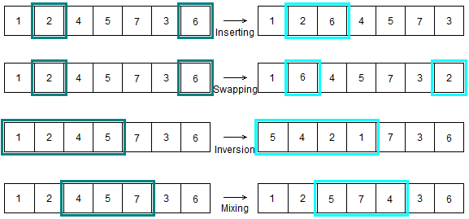
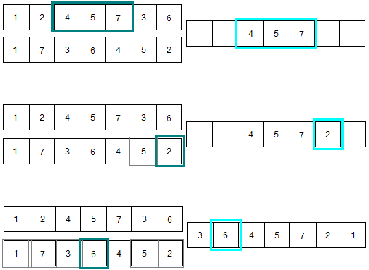
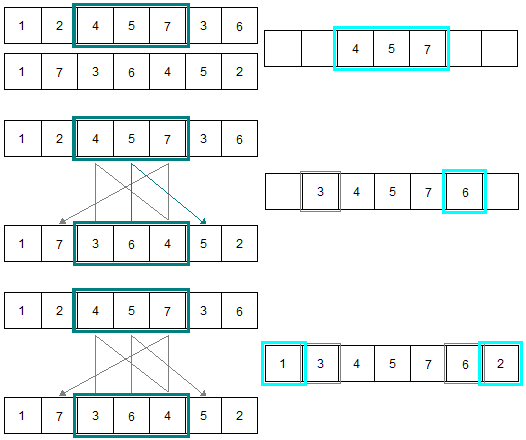
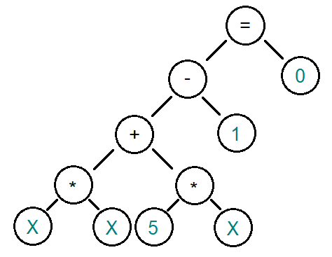
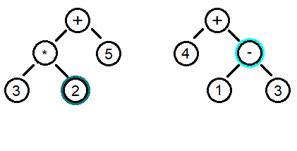
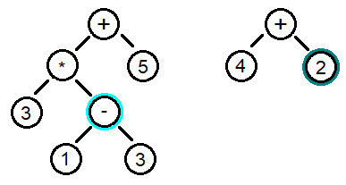
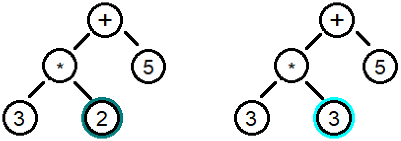
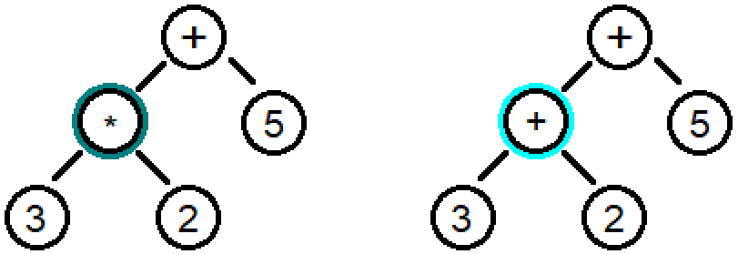

# 1. Uvod


## 1.1 Napredni alati:
 1. **Deskriptivni alati:** 
Fokusiraju se na analizu onoga što se već dogodilo ili šta se trenutno dešava. Izveštavaju i daju uvid u prošle i trenutne performanse sistema ili poslovanja. Primeri uključuju analize prodaje u prethodnim kvartalima, podatke o prometu na web stranicama, ili izveštaje o korisničkom zadovoljstvu.

 2. **Prediktivni alati:**
Koriste statističke tehnike i algoritme mašinskog učenja za predviđanje budućih događaja ili ponašanja na osnovu istorijskih podataka. Na primer, predviđanje potražnje za proizvodima, prognoze vremenskih uslova, ili predviđanje kvarova na mašinama.

 3. **Preskriptivni alati:** 
Ovi alati idu korak dalje od predikcije jer ne samo da govore šta će se dogoditi, već i sugerišu šta treba preduzeti kako bi se postigli željeni rezultati. Oni koriste optimizacione algoritme i simulacije kako bi preporučili najbolje akcije ili odluke, npr. optimizacija zaliha u trgovini ili kreiranje efikasnih ruta za dostavu.

## 1.2 Mašinsko učenje:
Grana veštačke inteligencije koja omogućava sistemima da uče iz podataka bez eksplicitnog programiranja.\
**Prediktivna analitika** je ključna primena mašinskog učenja, jer se koristi za analizu i predviđanje budućih trendova. Ovo uključuje rad sa ogromnim količinama podataka, obično u realnom vremenu, gde se model trenira na istorijskim podacima kako bi prepoznao obrasce i pravio predviđanja.\
Kako podaci postaju zastareli, zrelost modela opada što znači da modeli postaju manje tačni i efikasni vremenom.

# 2. Paradigme u veštačkoj inteligenciji:
 
 Osnovne paradigme: 
1. Veštačke neuronske mreže (ANN)  
2. Evolutivna izračunavanja (EC) 
3. Inteligencija grupa (SI)
4. Veštački imuni sistem (AIS)
5. Rasplinuti sistemi (Fuzzy systems)

O svim paradigmama biće dodatno rečeno. Svaka od paradigmi ima svoje podparadigme zasnovane/inspirisane istim principima.

## 2.1 Veštačke neuronske mreže (ANN):
Ove mreže oponašaju način na koji ljudski mozak obrađuje informacije, koristeći veštačke neurone koji obrađuju informacije kroz slojeve. Svaki neuron prima ulazne podatke (npr. informacije iz okruženja ili drugih neurona), množi ih odgovarajućim težinama (w1, w2, w3…) i primenjuje aktivacionu funkciju kako bi odlučio da li će poslati signal i sa kojom snagom. ANN se široko koriste u oblastima kao što su prepoznavanje zvuka (npr. u glasovnim asistentima), prepoznavanje oblika (npr. u računalnoj viziji), i kontrola robota.

Ovi koncepti i alati su ključni za razumevanje savremenih tehnika veštačke inteligencije i mašinskog učenja, posebno u kontekstu njihovih praktičnih primena i sposobnosti.


## 2.2 Evolutivna izračunavanja (EC)
Evolutivna izračunavanja su metoda optimizacije zasnovana na simulaciji prirodne selekcije, gde se jedinke koje su bolje prilagođene okruženju "preživljavaju" i prenose svoje "gene" (karakteristike) na sledeće generacije. Oni koji se lošije prilagode ne prenose svoje gene, što omogućava da populacija u celini postane bolja vremenom. Rekombinacija gena preživelih jedinki stvara nova rešenja, simulirajući prirodni evolucioni proces. Na ovaj način, evolutivni algoritmi "uče" kroz generacije kako da dođu do optimalnog rešenja za zadati problem.

#### Ključni koncepti:
- **Populacija:** Skup potencijalnih rešenja (jedinki) u algoritmu.
- **Fitnes funkcija:** Funkcija koja ocenjuje koliko je svaka jedinka uspešna u rešavanju problema.
- **Selektivni pritisak:** Jedinke sa boljim karakteristikama imaju veću šansu da prenesu svoje gene na sledeće generacije.

### 2.2.1 Genetski algoritmi (GA):
Genetski algoritmi su najpoznatija forma evolutivnih izračunavanja i funkcionišu tako što predstavljaju rešenja problema kao nizove binarnih vrednosti (0 i 1), poznate kao "hromozomi". Svaki hromozom predstavlja jedan mogući način rešavanja problema. Algoritam zatim koristi operacije kao što su **rekombinacija (ukrštanje)** i **mutacija** kako bi stvorio nove jedinke (nove nizove 0 i 1) u svakoj generaciji. Ove nove jedinke se zatim testiraju pomoću fitnes funkcije, a one koje daju bolje rezultate imaju veće šanse da budu zadržane i dalje evoluiraju.

#### Ključne operacije u GA:
- **Ukrštanje (Crossover):** Dva roditeljska rešenja se kombinuju da bi se kreirala nova rešenja.
- **Mutacija:** Nasumična promena vrednosti unutar rešenja, koja obezbeđuje raznolikost i izbegava lokalne minimume.

||
|-|
||

### 2.2.2 Genetsko programiranje (GP):
Genetsko programiranje je posebna vrsta evolutivnog algoritma koja ne evoluira nizove brojeva ili binarne kodove kao u genetskim algoritmima, već evoluira **programe**. Svaki jedinka je računski program koji se optimizuje kroz generacije. Cilj je stvoriti program koji na najbolji način rešava zadati problem. Kroz generacije, GP koristi rekombinaciju, mutacije i selekciju kako bi kreirao sve efikasnije programe.

#### Glavne karakteristike GP:
- Evoluira se **struktura programa**.
- Može se koristiti za automatizovano generisanje koda, kreiranje strategija ili predikcionih modela.
- Primene uključuju dizajn algoritama, modeliranje i predikciju, kao i automatizaciju zadataka.
  
### 2.2.3 Evolutivno programiranje (EP):
Evolutivno programiranje se razlikuje od genetskih algoritama po tome što se ne fokusira na rekombinaciju gena, već se promene vrše na individualnim jedinkama kroz stohastičke mutacije. U EP, populacija je skup rešenja koja se optimizuju kroz promenu pojedinih karakteristika (članova niza) rešenja. Cilj EP je pronaći optimalno rešenje kroz iterativno prilagođavanje rešenja bez direktne rekombinacije.

#### Ključne karakteristike EP:
- Promene su stohastičke i odnose se na pojedinačne elemente niza.
- Fokus je na mutaciji i evoluciji kroz generacije.
- Koristi se u rešavanju problema optimizacije i modeliranja složenih sistema.

### 2.2.4 Koevolucija:
Koevolucija opisuje proces u kojem različite populacije evoluiraju u međusobnoj interakciji. Ovo znači da evolucija jedne populacije zavisi od evolucije druge. Primer su predatori i plen u prirodi: kako plen postaje brži i spretniji, tako predatori moraju evoluirati da bi ih i dalje hvatali. U kontekstu algoritama, to može uključivati "parazite" ili ometajuće faktore koji usporavaju ili komplikuju evolucioni proces, čineći zadatak težim za optimizaciju.

#### Ključne karakteristike koevolucije:
- Evolucija se dešava u međusobno zavisnim populacijama.
- "Paraziti" mogu ometati ili izazivati osnovnu populaciju da se prilagođava.
- Koristi se u problemima gde postoji višestruka interakcija između različitih elemenata, kao što su igre sa više igrača, tržišne simulacije, ili optimizacija mreža.

### 2.2.5 Koristi evolutivnih izračunavanja:
#### Evolutivna izračunavanja se najčešće koriste kada:

1. **Ne postoji deterministički algoritam** koji može u prihvatljivom vremenu dati rešenje za problem. Na primer, složeni problemi optimizacije ili np-teški problemi ne mogu se efikasno rešiti determinističkim algoritmima.
2. **Klasifikacija podataka** je potrebna, mada mašinsko učenje često nudi bolja rešenja za ove zadatke. Ipak, evolutivni algoritmi mogu biti korisni kada je problem specifičan ili ne može lako da se modelira korišćenjem tradicionalnih tehnika mašinskog učenja. 

Evolutivni algoritmi pružaju fleksibilnost i mogu istraživati veliki prostor rešenja, često pronalazeći neintuitivna, ali efikasna rešenja za složene probleme.

## 2.3 Inteligencija grupa (Swarm Intelligence - SI):
Odnosi se na sposobnost grupa organizama, poput ptica, mrava ili pčela, da pokažu složeno ponašanje kroz jednostavne individualne interakcije. Ovi organizmi funkcionišu prema pravilima kolektivnog ponašanja, gde svaka jedinka donosi jednostavne odluke, ali zajedno postižu inteligentne rezultate bez centralizovane kontrole. U domenu veštačke inteligencije, SI se koristi za optimizaciju i rešavanje složenih problema, imitirajući ovu vrstu grupne koordinacije.

### 2.3.1 PSO (Particle Swarm Optimization):
PSO je metoda optimizacije koja se zasniva na kolektivnom ponašanju jata ptica. U ovom algoritmu, ptice (ili čestice) se kreću kroz višedimenzioni prostor podataka, tražeći optimalno rešenje problema. Svaka čestica u PSO algoritmu prilagođava svoju poziciju na osnovu sopstvenog iskustva i iskustva drugih čestica iz jata. Kako se ptice kreću kroz prostor, privlače jedna drugu ka boljim rešenjima, pa su veće šanse da će se kretati ka optimalnom rešenju. Na sličan način funkcionišu i algoritmi zasnovani na ponašanju mrava (ACO - Ant Colony Optimization), gde mravi tragaju za optimalnim rešenjem problema zasnovanim na lokalnim interakcijama i ponašanju grupe.

## 2.4 Rasplinuti (fuzzy) sistemi: 
Ovo su sistemi koji mogu raditi sa nejasnim, nepotpunim ili dvosmislenim informacijama. 
Umesto da koriste striktna pravila kao klasični sistemi, rasplinuti sistemi omogućavaju "sive zone", gde se odluke donose na osnovu verovatnoće ili približnih vrednosti.
Logika nije strogo binarna (0 ili 1), već vrednosti mogu biti između 0.0 i 1.0. U ovim sistemima, odluke se donose na osnovu stepena pripadnosti određenim skupovima, što omogućava fino podešavanje odluka i ponašanja u situacijama koje nisu strogo definisane. 

| S                               | Trapez                               | Trougao                                |
| ------------------------------- | ------------------------------------ | -------------------------------------- |
|  |  |  |

Fazi logika dozvoljava rad sa nepreciznim, nejasnim ili nepotpunim informacijama, simulirajući ljudsko rasuđivanje u takvim uslovima. Koriste se u oblasti kontrole, kao što su pametni termostati ili sistemi za navigaciju.

# 3. Veliki jezički modeli (LLM): 
Složeni algoritmi zasnovani na ANN, kao što su chat roboti, koji su trenirani na velikim količinama podataka kako bi mogli da razumeju i odgovaraju na pitanja u prirodnom jeziku. Ovi modeli koriste prethodno analizirane i ispitane podatke, i primenjuju se u specifičnim, užim domenima, ali su dovoljno fleksibilni da odgovaraju na različite upite u okviru svog znanja. Velika baza podataka omogućava im da analiziraju i razumeju pitanja, a zatim generišu odgovore koristeći tehnike generisanja prirodnog jezika (NLG - Natural Language Generation).

#### Način rada LLM-a:
1. **Analiza podataka pomoću dubokog učenja:** Ovaj proces uključuje obradu i razumevanje velikih količina podataka kako bi LLM model mogao da nauči zakonitosti ljudskog jezika.

2. **Generisanje odgovora na osnovu podataka (NLG):** Nakon što LLM razume pitanje, koristi svoju bazu znanja da generiše koherentan i relevantan odgovor.

#### Proces pravljenja LLM-a:

1. **Priprema:** U ovoj fazi vrši se tokenizacija (razbijanje teksta na manje delove ili tokene), uzorkovanje podataka i umetanje tokena koji su relevantni za dalje učenje modela.
2. **Mehanizam pažnje (attention mechanism):** Fokusira se na specifične delove ulaznih podataka kako bi generisao specifične delove izlaznih odgovora, omogućavajući modelu da efikasnije procesira relevantne informacije. Dve popularne kategorije su **instruction** i **classification** fine-tuning.
    - **Instruction fine-tuning** : podaci sadrže instrukcije i već predodređena rešenja.
    - **Classification fine-tuning** : podaci su označeni sa klasom koju treba da asociraju (npr. mejlovi koji su asocirani sa "spam" i "not spam") 
3. **Arhitektura LLM-a:** Sve informacije se kombinuju u koherentnu strukturu koja omogućava modelu da obavlja zadatke učenja i generisanja odgovora.
4. **Prethodno treniranje i treniranje:** Model se inicijalno trenira od nule koristeći velike skupove podataka, gde uči osnovne jezičke strukture i zakonitosti.
5. **Fino obučavanje:** Nakon inicijalnog treniranja, model se dodatno usavršava na specifičnim skupovima podataka, kako bi bio prilagođen za određene domene i zadatke (na primer, pravni savetnici, medicinski asistenti).

## 3.1 Transformer arhitektura:
Većina LLM-ova se oslanja na transformer arhitekturu, NNA predstavljen 2017, prvo korišćen za mehanizam prevođenja engleskog teksta u tekst na nemačkom ili francuskom. \
Sastavljen iz dva modula:\
	- **enkoder**: procesuira uneti tekst i predstavlja ga u vidi vektora sa numeričkim vrednostima koji predstavlja kontekst teksta.\
	- **dekoder**: vektor enkodera se daje dekoderu koji dekodira dobijeni vektor i gradi rečenicu u izabranom jeziku.

Izgrađeni na ovom konceptu su:

**BERT** (bidirectional encoder representations from transformer) - pronalazi sakrivene/maskirane reči u tekstu. (korišćen je na Twitteru za pronalaženje neprikladnih postova)\
**GPT** (generative pretrained transformers) - generiše tekst (prevođenje, pisanje koda, dovršavanje rečenica...), trenirani da predpostave sledeću reč na osnovu već ispisanih reči...

LLM i transformer se danas tretiraju kao sinonimi usled velike zasnovanosti LLM-a na arhitekturi transformera.

## 3.2 Ograničenja LLM-a:

1. **Razumevanje konteksta:** Iako LLM-ovi mogu obrađivati veliki broj informacija, često imaju poteškoće sa dubljim razumevanjem konteksta ili složenih apstraktnih veza.
2. **Pristrasnost:** LLM modeli su često pristrasni jer se oslanjaju na podatke na kojima su trenirani. Ako ti podaci sadrže pristrasnost, i sam model će ih reflektovati.
3. **Zdrav razum:** Iako mogu simulirati razumevanje jezika, LLM-ovi nemaju zdrav razum kakav ljudi poseduju, što znači da mogu generisati odgovore koji su logički tačni, ali nemaju smisla u realnim situacijama.
4. **Etika: (iz predhodne tri tačke)** Odluke i odgovori koje generišu LLM modeli zavise od podataka na kojima su obučeni, što može voditi do etičkih dilema, kao što su širenje netačnih informacija ili diskriminatornih stavova.

# 4. Optimizacioni algoritmi: 
Specifična vrsta algoritama koji pripadaju grupi pretrage, a njihov glavni cilj je da pronađu optimalno rešenje za datu ciljnu funkciju, koja može biti minimizacija ili maksimizacija, uz određeni skup ograničenja.

## 4.1 Osnovni pojmovi:
**Funkcija cilja:** Ovo je funkcija koja mapira prostor rešenja (S) u realne brojeve (R). Oblik funkcije može biti (f: S -> R). Kada se govori o minimizaciji, cilj je pronaći takvu vrednost **x** da je f(x) minimalna. U isto vreme, maksimizacija funkcije f može se izraziti kao minimizacija njene negacije, tj. (-f). Ovde **x** predstavlja nezavisne promenljive koje utiču na vrednost funkcije cilja.

**Skup ograničenja:** Ovaj skup definiše zavisnosti između nezavisnih promenljivih. Ograničenja mogu biti postavljena na način da definišu dozvoljene vrednosti za promenljive, kao i odnose među njima. Ograničenja mogu biti zasnovana na jednakostima (npr. $g(x) = 0$) i/ili nejednakostima (npr. $h(x) \leq 0$).

**Globalni minimum** je najmanja vrednost funkcije u celokupnom prostoru rešenja. 

**Lokalni minimumi** su minimalne vrednosti funkcije unutar određenih područja prostora rešenja. 

U mnogim slučajevima, algoritmi optimizacije mogu naići na lokalne minimume koji nisu globalni, što može otežati postizanje optimalnog rešenja.

## 4.2 Optimizacione metode:
Optimizacione metode imaju za cilj da pronađu optimum u prostoru dozvoljenih rešenja. Rešenja su dozvoljena ako su zadovoljena postavljena ograničenja. 

**Klasifikacija metoda:**
1. **Pretraga:** Metode se mogu deliti na **lokalne** i **globalne** metode pretrage. Lokalne metode traže rešenja u blizini trenutnog rešenja, dok globalne metode pretražuju širi prostor rešenja kako bi pronašle najbolja moguća rešenja.
2. **Pristup pretrage:** Postoje **stohastičke** metode (poput Monte Karlo) koje koriste nasumične uzorke da bi istražile prostor rešenja, i **determinističke** metode koje koriste unapred definisane strategije i pravila. 
	Cesto se koriste kombinacije stohastičkog i determinističkog pristupa.

## 4.3 Ograničenja:
Ograničenja u optimizaciji mogu se primenjivati na sledeće načine:

1. **Odbacivanje:** Nedozvoljena rešenja se jednostavno odbacuju.
2. **Dodeljivanje penala:** Nedozvoljenim rešenjima se dodeljuju
kazneni bodovi, što ih čini manje atraktivnim tokom pretrage.
3. **Smanjivanje na bez ograničenja:** Rešenja se prvo optimizuju bez ograničenja, a zatim se dodaju ograničenja kako bi se izabrala dopustiva rešenja.
4. **Održavanje dopustivosti:** Tokom pretrage, održava se dopustivost rešenja tako što se stalno proveravaju ograničenja.
5. **Uređivanje dopustivih rešenja:** Metode se koriste za generisanje i održavanje skupa dopustivih rešenja.
6. **Popravljanje:** Ako se naiđe na nedozvoljeno rešenje, mogu se primeniti metode za njegovo ispravljenje kako bi postalo dozvoljeno.

## 4.4 Prostor rešenja:
Prostor rešenja u kojem se vrši optimizacija može se podeliti na:
- **Kombinatornu optimizaciju:** Ova vrsta optimizacije se bavi problemima gde je prostor rešenja diskretan (npr. raspoređivanje, putnički problem, itd.).
- **Globalnu optimizaciju:** Ova metoda se bavi problemima u kojima su rešenja kontinualna i gde se traži najbolja moguća vrednost funkcije cilja u celokupnom prostoru rešenja.

Ove klasifikacije i principi igraju ključnu ulogu u razvoju i primeni optimizacionih algoritama u različitim oblastima, uključujući inženjering, ekonomiju, operativna istraživanja i mnoge druge.

## 4.5 Kombinatorna oprimizacija:
Predstavlja oblast optimizacije koja se fokusira na probleme u kojima je prostor rešenja diskretan, a jedan od najpoznatijih primera je **problem trgovackog putnika (TSP - Traveling Salesman Problem)**. 

U ovom problemu, trgovac treba da obiđe određeni broj gradova tako da se vrati u početni grad, a cilj je minimizirati ukupnu udaljenost ili vreme putovanja.

### 4.5.1 Opšta formula algoritma pretrage:
**Dok nije zadovoljen kriterijum završetka:** 
Algoritam se nastavlja dok se ne postigne određeni cilj ili kriterijum.
1. **Izračunaj vrednost:** Prvo se izračunava vrednost funkcije cilja za trenutno rešenje.
2. **Izračunaj pravac i smer pretrage:** Na osnovu trenutne vrednosti, određuje se pravac u kojem će se nastaviti pretraga.
3. **Izračunaj dužinu koraka pretrage:** Definiše se koliko daleko se ide u odabranom pravcu.
4. **Pređi u naredno rešenje:** Na osnovu prethodnih koraka, prelazi se na sledeće rešenje u pretrazi.

### 4.5.2 Višeciljna optimizacija:
Višeciljna optimizacija se koristi kada je potrebno zadovoljiti više kriterijuma (funkcija). Ovo je posebno važno u složenim situacijama kao što su ekonomija i transportni problemi, gde se često moraju razmatrati različiti faktori, poput troškova, vremena, kapaciteta i kvaliteta usluge.

## 4.6 Pristupi rešavanju:
#### Postoje dva glavna pristupa u rešavanju višeciljnih optimizacija:
1. **Pravljenje ponderisanih proseka (agregacija):** Ovaj pristup uključuje kombinovanje više ciljeva u jednu jedinstvenu funkciju cilja putem ponderisanja, što omogućava da se različiti kriterijumi tretiraju kao jedinstveni problem. Na taj način, svaki kriterijum se množi sa svojim težinskim faktorom, a zatim se sumiraju.
2. **Pravljenje skupa Pareto-optimalnih rešenja:** Ovaj pristup identifikuje rešenja koja su optimalna u smislu Pareto efikasnosti, što znači da nijedno rešenje ne može biti poboljšano u jednom kriterijumu bez pogoršanja u drugom. Pareto-optimalna rešenja omogućavaju odlučivačima da biraju između različitih opcija u skladu sa svojim preferencama.

Ovi pristupi su ključni za uspešno rešavanje složenih problema u optimizaciji, omogućavajući analizu i donošenje odluka u situacijama gde su zahtevi višestruki i često suprotstavljeni.

## 4.7 Algoritam za rešavanje problema:
Algoritam za rešavanje problema predstavlja metod kojim dolazimo do rešenja određenog zadatka ili zadatog problema. Svaki specifičan problem koji rešavamo naziva se **instanca problema**. Na primer, problem prelaska iz tačke A do tačke B može imati različite instance u zavisnosti od specifičnih početnih i krajnjih tačaka.

### 4.7.1 Problem odlučivanja:
Problem odlučivanja je tip problema gde je cilj potvrditi ili opovrgnuti određeno svojstvo. Ovi problemi pripadaju klasi **P** (polinomijalna složenost), što znači da se mogu rešavati algoritmima koji rade u polinomijalnom vremenu u odnosu na veličinu ulaznih podataka. 

Većina problema može se svesti na oblik problema odlučivanja. Algoritmi koji rešavaju probleme u polinomijalnom vremenu smatraju se **optimalnim**, jer su vremenski efikasni i rešivi u razumnom vremenu za praktične ulaze.

### 4.7.2 Pristupi rešavanju problema:
1. **Egzaktno rešavanje:** Ovim pristupom se dolazi do garantovano optimalnog rešenja za problem. Koriste se algoritmi koji pružaju tačan odgovor, ali to može biti vremenski zahtevno za velike probleme.
2. **Približno rešavanje:** Približni algoritmi, često bazirani na (meta)heuristikama, pružaju rešenja koja nisu nužno optimalna, ali su dovoljno dobra u praksi. Ovi pristupi su korisni kada je problem previše složen za egzaktno rešavanje u razumnom vremenu (np ili eksponencijalne slozenosti).

#### Vremenska složenost i O notacija:
Vremenska složenost algoritma opisuje kako se vreme izvršavanja algoritma menja sa veličinom ulaznih podataka. **O notacija** koristi se za izražavanje gornje granice složenosti algoritma i omogućava klasifikaciju algoritama prema njihovoj efikasnosti.

#### Eksponencijalni problemi:
Vreme izvršavanja raste eksponencijalno sa veličinom ulaznih podataka. Primer eksponencijalnog problema je „pronalazak svih razapinjajućih stabala u potpunom grafu sa n čvorova“ ili „traženje najboljeg poteza u igri šaha“. Eksponencijalni problemi su računski vrlo zahtevni i obično nisu rešivi u razumnom vremenu za velike ulaze.

#### Nedeterministički polinomski problemi (np):
**np problemi** su problemi za koje je moguće proveriti rešenje u polinomijalnom vremenu, ali nije jasno da li ih možemo i rešiti u polinomijalnom vremenu za svaki slučaj. Za takve probleme nije poznato da li se mogu tačno rešiti u polinomijalnom vremenu.

### 4.7.3 Redukcija problema:
**Redukcija** se koristi za prevođenje problema na poznati oblik radi lakšeg rešavanja. Na primer, imamo problem $A_1$ za koji postoji poznat algoritam, dok problem $A_2$ predstavlja novi problem koji treba rešiti. Ako možemo prevesti problem $A_2$ u problem $A_1$ (koji već znamo da rešavamo), tada se problem $A_2$ može rešavati algoritmom za $A_1$.

### 4.7.4 np-potpunost:
**np-potpuni problemi** su specifični np problemi za koje važi da, ako možemo napraviti algoritam koji ih rešava u polinomijalnom vremenu (P složenosti), svi np problemi mogu se rešiti u polinomijalnom vremenu (ovo najverovatnije nije moguce, neki smatraju da su klase P i np odvojene klase). np-potpuni problemi su istovremeno najteži problemi u np klasi i sinonim za np-teške probleme.


## 4.8 Optimizacija:
Optimizacija se odnosi na proces pronalaženja najboljeg rešenja za zadati problem u prostoru mogućih rešenja. Glavni cilj optimizacije je minimizacija ili maksimizacija određene funkcije cilja, a razlikuju se lokalna i globalna optimizacija.

### Lokalna optimizacija:
**Lokalna optimizacija** se fokusira na pronalaženje najboljeg rešenja u neposrednom okruženju trenutnog rešenja, često nazivano **lokalni minimum**.\
Nedostatak ovog pristupa je to što, čak i ako dođemo do lokalnog minimuma, možda ćemo propustiti bolje, globalno rešenje.

Načina za proširenje pretrage:

- **Povećanje koraka pretrage** – iako može pomoći u pronalaženju boljih rešenja, ne garantuje pronalazak globalnog minimuma.
- **Nasumično ispitivanje tačaka** – nasumičnim pokušajima, tokom dugog trajanja pretrage, povećava se verovatnoća da ćemo pronaći globalni minimum.

### Metaheuristike:
Predstavljaju skup opštih metoda koje pružaju okvir za rešavanje optimizacionih problema, često na osnovu stohastičnih, odnosno nasumičnih, procesa. One su korisne kada nemamo precizne informacije o optimalnom rešenju. Uglavnom se baziraju na „slabim“ pretpostavkama ili čak na odsustvu pretpostavki o problemu, čineći ih fleksibilnim za različite primene.

### Penjanje uzbrdo:
**Penjanje uzbrdo** (eng. Hill Climbing) je tehnika koja se zasniva na **gradijentnom kretanju**. 

Postupak je sledeći:
1. Počnemo sa nekom vrednošću (rešenjem).
2. Odredimo kvalitet tog rešenja pomoću fitnes funkcije.
3. Blago promenimo početno rešenje, prelazeći u novu iteraciju, i uporedimo rezultate. Ako je novo rešenje bolje, usvajamo ga kao polaznu tačku za sledeću iteraciju.

### Intenzifikacija i diverzifikacija:
- **Intenzifikacija (exploitation)** – fokusiramo se na pretragu u blizini trenutnog dobrog rešenja, oslanjajući se na postojeća dobra rešenja kako bismo dobili stabilne rezultate.
- **Diverzifikacija (exploration)** – povremeno skrećemo sa utvrđenog puta kako bismo istražili nova rešenja i eventualno otkrili bolje mogućnosti, postižmo izabiranjem lošijeg rešenja.

### Single-State globalna optimizacija:
Uključuje niz koraka za pronalaženje najboljeg mogućeg rešenja iz globalne perspektive, tj. uzimajući u obzir ceo prostor mogućih rešenja.

1. **Selection (Izbor)** – biranje trenutnog rešenja kao početne tačke.
2. **Jump to Something New (Prelazak na novo)** – prelazak u različite oblasti prostora rešenja, omogućavajući izbegavanje lokalnih minimuma.
3. **Use a Large Sample (Korišćenje velikog uzorka)** – istraživanje većeg broja mogućih rešenja kako bi se povećala šansa za pronalaženje globalnog optimuma.

# 5. Grafovi

**Graf** je matematička struktura koja se koristi za modeliranje odnosa između objekata.

Sastoji se od osnovnih komponenti:

1. **Čvorovi (vertices)** – predstavljaju entitete u grafu (gradovi).
2. **Grane (edges)** – povezuju čvorove, označavajući odnos između njih (putevi izmedju gradova).

**Put** – niz grana koji povezuje jedan čvor sa drugim.\
**Ciklus** – put koji počinje i završava u istom čvoru, čineći zatvorenu petlju.\
**Brojčani stepen čvora** – broj grana koje izlaze iz određenog čvora.\
**Izolovani čvor** – čvor koji nije povezan sa nijednim drugim čvorom.\
**Susedi** – čvorovi koji su direktno povezani sa nekim čvorom putem grana.\
**Ekscentričnost čvora** - meri najveću udaljenost (broj grana) do bilo kojeg drugog čvora u grafu. Ovo može biti korisno u analizi mreža kako bi se identifikovali najudaljeniji čvorovi od određenih polaznih tačaka.\
**Komponente povezanosti** - su podgrafovi unutar grafa gde su svi čvorovi međusobno povezani, dok su čvorovi iz različitih komponenti odvojeni jedni od drugih jednom granom. Ovo je ključno u analizi mreža, jer ukazuje na različite grupe unutar strukture grafa.

Grafovi su primenljivi u različitim oblastima, kao što su **lingvistika** (analiza strukture rečenica), **informatika**, **biologija** (analiza odnosa u genomima), i **društvene mreže** (modeliranje povezanosti korisnika).

## 5.1 Multigraf:
**Multigraf** je tip grafa koji sadrži **paralelne grane**, odnosno više grana između istih parova čvorova. Koristi se kada su moguće različite veze između istih entiteta (npr. različiti putevi između dva grada)

## 5.2 Težinski i netežinski grafovi:
1. **Težinski grafovi** – svaka grana ima pridruženu vrednost ili težinu. (može predstavljati udaljenost, trošak, vreme, itd.)
2. **Netežinski grafovi** – grane nemaju težinu. Važno je samo da povezuju čvorove, ne koliko su te veze „teške“ ili „skupe“.

## 5.3 Usmereni grafovi:
**Usmereni grafovi** su grafovi u kojima svaka grana ima definisan pravac, tj. vodi od jednog čvora ka drugom, poput jednosmernih ulica u saobraćajnim mrežama. U usmerenim grafovima mogu postojati grane koje su dvosmerne.

## 5.4 Drvo:
**Drvo** je specijalna vrsta grafa koja ima sve čvorove povezane tako da ne sadrži cikluse. Sastoji se od čvorova i grana i karakteriše se time što postoji tačno jedan put između svakih parova čvorova. Drveće se često koristi u informatici za organizaciju podataka (npr. u pretraživačkim algoritmima) jer omogućava strukturu sa efikasnim pretragama i manipulacijama podacima.

# 6. Linearno programiranje (LP):
**Linearno programiranje (LP)** predstavlja optimizaciju linearne funkcije sa ograničenjima koja su izražena kao nejednakosti. Na primer, farmer ima ograničene resurse za sadnju povrća, linearno programiranje može mu pomoći da maksimizira profit unutar tih ograničenja.

## 6.1 Pogodan region (Feasible Region):
Pogodan region predstavlja prostor rešenja dobijen presecima ograničenja, koji čine prostor u kojem pretražujemo optimalna rešenja. Kod problema sa više promenljivih, ovaj prostor se nalazi u višedimenzionalnom prostoru. Minimalna ili maksimalna vrednost ciljne funkcije će se sigurno naći u nekoj od graničnih tačaka ovog regiona, kao što su teme, ivice ili stranice.

## 6.2 Geometrijski princip rešavanja:
Za pronalaženje optimalnog rešenja linearna funkcija (npr. ( $ax + by = c$ )) se "pomeranjem" kroz pogodan region (menjanjem vrednosti konstante ( $c$ )) postavlja u najvišu ili najnižu tačku gde dotiče region. Kada funkcija prestane da se pomera unutar ovog prostora, dostigli smo optimalno rešenje.

| Svi uslovi                           | Dobijen pogodni region                  |
| ------------------------------------ | --------------------------------------- |
|  |  |

Plavo predstavlja ograničenje količine šargarepa, crveno ogranićenje krompira, zeleno da njihov zbir ne prelazi $5000$.

Na slici vidimo da je zapravo pogodan region bas presek ove tri boje, racunajuci samo ono u pozitivnom delu.

| Min                       | Mid                       | Max                       |
| ------------------------- | ------------------------- | ------------------------- |
|  |  |  |

Pomeranjem funkcije $ax + by = c$, uvećavanjem konstante $c$ nalazimo maksimum. Minimalno rešenje za $c = 0$, a maksimum za $c = 8000$.

Međutim, geometrijski pristup nije efikasan za složenije probleme, te se koristi **Simplex metod**.


## 6.3 Simplex metod:
Simplex metod optimizuje linearnu funkciju pomerajući se po ivicama pogodne oblasti, od temena do temena. Na osnovu svojstva da se optimum nalazi u temenima (ili na ivicama), Simplex postupno menja vrednosti promenljivih, identifikujući onu promenljivu koja će uvećati funkciju. Promenljive koje se menjaju nazivamo "popuštene" (loose ili non-basic), dok su one koje ostaju nepromenjene "zategnute" (tight ili basic).

#### Koraci Simplex algoritma:
1. Definišemo linearnu funkciju(promenljive se predstavljaju sa x i dodeljenim indeksom) i ograničenja. $f(x_1, x_2) = ax_1 + bx_2$
2. Svakom ograničenju dodeljujemo novu promenljivu, čime svodimo nejednakosti na jednakosti. $s_1, s_2,\ldots$
3. Na početku sve s-promenljive su popuštene (loose), i stoje same sa leve strane jednačine.
4. Algoritam:
   - Biramo promenljivu sa najvećim koeficijentom u funkciji i "popuštamo" je.
   - Biramo koju s-promenljivu ćemo "zategnuti" na osnovu razmera konstanti u ograničenjima.
   - Ubacujemo dobijenu vrednost promenljive u funkciju i ponavljamo proces dok svi koeficijenti uz promenljive ne postanu negativni.

### 6.3.1 Primer primene simplex algoritma – Farmer:
Farmer može posaditi šargarepu (4 tone) i krompir (3 tone), ima 5 tona đubriva (dakle, može posaditi maksimalno 5 tona povrća). Krompir donosi 1,2 evra po kilogramu, dok šargarepa donosi 1,7 evra. Cilj je maksimizacija profita: 
1. Definišemo funkciju: $f(x_1, x_2) = 1.7 * x_1 + 1.2 * x_2$, sa ograničenjima:
$$x_1 \leq 4000$$
$$x_2 \leq 3000$$
$$x_1 + x_2 \leq 5000$$
2. Tight: $x_1$, $x2$:
$$x_1 + s_1 = 4000$$
$$x_2 + s_2 = 3000$$
$$x_1 + x_2 + s_3 = 5000$$
3. Loose: $s_1$, $s_2$, $s_3$:
$$s_1 = 4000 - x_1$$
$$s_2 = 3000 - x_2$$
$$s_3 = 5000 - x_1 - x_2$$
4. U formuli $max(1.7 * x_1 + 1.2 * x_2)$, najveći koeficijent ima $x_1$, pa prelazi u loose skup, posmatramo u kojim fomrulama se pojavljuje, vidimo ga u 1. i 3., upoređujemo razmere $-4000 \geq -5000$, dakle $s_1$ prelazi u tight skup. Raspoređujemo opet tight i loose elemente na predodređene strane jednačine, pa se menja samo prva jednačina $x_1 = 4000 - s_1$ i menjamo je u sve ostale:
$$x_1 = 4000 - s_1$$
$$s_2 = 3000 - x_2$$
$$s_3 = 1000 + s_1 - x_2$$
$$max(-1.7 * s_1 + 1.2 * x_2 + 6800)$$
Kako idalje imamo pozitivne koeficijente u funkciji ponavljamo 4. korak. Sada je najveći koeficijent uz $x_2$ dakle on prelazi u skup loose, upoređujemo razmere $-3000 \leq -1000$, prebacujemo $s_3$ u tight i dobijemao $x_2 = 1000 - s_1 - s_3$, pa nju menjamo u ostale:
$$x_1 = 4000 - s_1$$
$$s_2 = 2000 - s_1 + s_3$$
$$x_2 = 1000 + s_1 - s_3$$
$$max(0.5 * s_1 - 1.2 * s_3 + 8000)$$
Kako su obe konstante negative znamo da ako pokušamo da maksimizujemo samo ćemo naći manja rešenja. Da bi našli traženu maksimalnu vrednost dovoljno je da zamenimo $s_1$ i $s_3$ sa 0, dobijamo 8000. Ako nas zanimaju vrednosti $x_1$ i $x_2$ dovoljno je da zamenimo $s_1$ i $s_3$ sa 0 u ograničenjima koje smo dobili, $x_1 = 4000$ i $x_2 = 1000$. Što je i tačno, pogledati maksimalno rešenje geoetrijskim pristupom. 

Kod linearnih programa, poželjno je koristiti veće brojeve za izražavanje vrednosti. Na primer koristimo tone umesto kilograma, što poboljšava tačnost proračuna.


```python
import linopy as lp
```


```python
modelFarmer = lp.Model()

x1 = modelFarmer.add_variables(lower=0.0, name="Šargarepa")
x2 = modelFarmer.add_variables(lower=0.0, name="Krompir")

modelFarmer.add_objective(1.7*x1 + 1.2*x2, sense='max')

modelFarmer.add_constraints(x1 <= 4000, name="Maksimalno 4 tone sargarepe")
modelFarmer.add_constraints(x2 <= 3000, name="Maksimalno 3 tone krompira")
modelFarmer.add_constraints(x1 + x2 <= 5000, name="Maksimalno 5 tona djubriva")

print(modelFarmer)

modelFarmer.solve()

print(f'Optimalno rešenje: \n\t Šargarepa = {x1.solution.values}'
      f'\n\t Krompira = {x2.solution.values}'
      f'\n\t Zarada = {1.7*x1.solution.values + 1.2*x2.solution.values}')
```

    Linopy LP model
    ===============
    
    Variables:
    ----------
     * Šargarepa
     * Krompir
    
    Constraints:
    ------------
     * Maksimalno 4 tone sargarepe
     * Maksimalno 3 tone krompira
     * Maksimalno 5 tona djubriva
    
    Status:
    -------
    initialized
    Set parameter Username
    Academic license - for non-commercial use only - expires 2025-10-07
    Read LP format model from file C:\Users\Vlado\AppData\Local\Temp\linopy-problem-9jjiblt_.lp
    Reading time = 0.00 seconds
    obj: 3 rows, 2 columns, 4 nonzeros
    Gurobi Optimizer version 11.0.3 build v11.0.3rc0 (win64 - Windows 11.0 (22631.2))
    
    CPU model: Intel(R) Core(TM) i7-8750H CPU @ 2.20GHz, instruction set [SSE2|AVX|AVX2]
    Thread count: 6 physical cores, 12 logical processors, using up to 12 threads
    
    Optimize a model with 3 rows, 2 columns and 4 nonzeros
    Model fingerprint: 0xd4bc8e95
    Coefficient statistics:
      Matrix range     [1e+00, 1e+00]
      Objective range  [1e+00, 2e+00]
      Bounds range     [0e+00, 0e+00]
      RHS range        [3e+03, 5e+03]
    Presolve removed 2 rows and 0 columns
    Presolve time: 0.01s
    Presolved: 1 rows, 2 columns, 2 nonzeros
    
    Iteration    Objective       Primal Inf.    Dual Inf.      Time
           0    8.5000000e+03   1.250000e+02   0.000000e+00      0s
           1    8.0000000e+03   0.000000e+00   0.000000e+00      0s
    
    Solved in 1 iterations and 0.02 seconds (0.00 work units)
    Optimal objective  8.000000000e+03
    Optimalno rešenje: 
    	 Šargarepa = 4000.0
    	 Krompira = 1000.0
    	 Zarada = 8000.0
    

Postoji i prošireni pristup poznat kao **Integer Linear Programming (ILP)**, koji dozvoljava samo celobrojne vrednosti, što može biti korisno u praktičnim situacijama gde su delimična rešenja nemoguća.

**Dualni problem**: Od prethodno postavljenog problema pravimo novi koji nam daje gornje ograničenje rešenja (koliko maksimalno para možemo da dobijemo a da su uslovi ispunjeni), rešenje dualnog problema će dati isto rešenje kao prvo postavljen problem.

Za gore navedena ograničenja tražimo takvo $y_1$, $y_2$ i $y_3$ da kada pomnože redom ograničenja dobijemo vrednosti koje u zbiru nam govore da tražena maksimalna vrednost ne može biti veca od dobijene. Moraju biti nenegativni, i posmatrajući ograničenja predstavljamo $x_1$ preko $y_1 + y_3 \geq$ 1.2 pošto je to baš vrednost koja stoji pored $x_1$. Slično za $x_2$ pravimo novo ograničenje $y_2$ + $y_3$ $\geq$ 1.7. 
Ovo su nam nova ograničenja a funkciju više ne želimo da maksimizujemo vež minimizujemo i ona menja oblik: min(3000 * $y_1$ + 4000 * $y_2$ + 5000 * $y_3$).


```python
modelFarmerDual = lp.Model()

y1 = modelFarmerDual.add_variables(lower=0.0, name="Neiskorišćena šargarepa")
y2 = modelFarmerDual.add_variables(lower=0.0, name="Neiskorišćeni krompir")
y3 = modelFarmerDual.add_variables(lower=0.0, name="Neiskorišćeno đubrivo")

modelFarmerDual.add_objective(3000*y1 + 4000*y2 + 5000*y3, sense='min')

modelFarmerDual.add_constraints(y2+y3 >= 1.7, name="Gubitak koji se odnosi na šargarepu")
modelFarmerDual.add_constraints(y1+y3 >= 1.2, name="Gubitak koji se odnosi na krompir")

print(modelFarmerDual)

modelFarmerDual.solve()

print(f'Optimalno rešenje: \n\t Neiskorišćena šargarepa = {y1.solution.values}'
      f'\n\t Neiskorišćeni krompir = {y2.solution.values}'
      f'\n\t Neiskorišćeno đubrivo = {y3.solution.values}'
      f'\n\t Zarada = {3000*y1.solution.values + 4000*y2.solution.values + 5000*y3.solution.values}')
```

    Linopy LP model
    ===============
    
    Variables:
    ----------
     * Neiskorišćena šargarepa
     * Neiskorišćeni krompir
     * Neiskorišćeno đubrivo
    
    Constraints:
    ------------
     * Gubitak koji se odnosi na šargarepu
     * Gubitak koji se odnosi na krompir
    
    Status:
    -------
    initialized
    Set parameter Username
    Academic license - for non-commercial use only - expires 2025-10-07
    Read LP format model from file C:\Users\Vlado\AppData\Local\Temp\linopy-problem-j8h1wzia.lp
    Reading time = 0.00 seconds
    obj: 2 rows, 3 columns, 4 nonzeros
    Gurobi Optimizer version 11.0.3 build v11.0.3rc0 (win64 - Windows 11.0 (22631.2))
    
    CPU model: Intel(R) Core(TM) i7-8750H CPU @ 2.20GHz, instruction set [SSE2|AVX|AVX2]
    Thread count: 6 physical cores, 12 logical processors, using up to 12 threads
    
    Optimize a model with 2 rows, 3 columns and 4 nonzeros
    Model fingerprint: 0x1c0d1e4c
    Coefficient statistics:
      Matrix range     [1e+00, 1e+00]
      Objective range  [3e+03, 5e+03]
      Bounds range     [0e+00, 0e+00]
      RHS range        [1e+00, 2e+00]
    Presolve time: 0.00s
    Presolved: 2 rows, 3 columns, 4 nonzeros
    
    Iteration    Objective       Primal Inf.    Dual Inf.      Time
           0    0.0000000e+00   2.900000e+00   0.000000e+00      0s
           2    8.0000000e+03   0.000000e+00   0.000000e+00      0s
    
    Solved in 2 iterations and 0.01 seconds (0.00 work units)
    Optimal objective  8.000000000e+03
    Optimalno rešenje: 
    	 Neiskorišćena šargarepa = 0.0
    	 Neiskorišćeni krompir = 0.5
    	 Neiskorišćeno đubrivo = 1.2
    	 Zarada = 8000.0
    

# 7. Celobrojno programiranje (ILP):

Šta ako se bavimo izradom stolica i stolova, koristeći gore LP način možemo da dobijemo rešenje koje nam donosi maksimalan profit ali izradom pola stolice.... Ovo nema smisla, zbog toga postoji celebrojno programiranje (**Integer linear prograimmng**) koje ograničava da su rešenja u skupu prirodnih brojeva.

## 7.1 Pogodan region ILP (ILP Feasable region):

Rešavamo problem stolica i stolova, imamo da stolice vrede $20$, stolovi $50$. Izrada stolica troši $10$ jedinica drveta, a stolova $15$, vremenski stolice se prave $2$ sata a stolovi $5$ sati. Koja je maksimalna zarada ako imamo $15$ sati i $60$ jedinica drveta za izradu.  

Grafički prikaz bi bio sličan kao za LP, prvo predstavimo feasable region kao da su dopuštena realna rešenja, nakon čega dodajemo ograničenje celobrojnih brojeva.

| LP ograničenja                   | LP Fesable region                   | ILP Fesable region                   |
| -------------------------------- | ----------------------------------- | ------------------------------------ |
|  |  |  |

Tačke predstavljaju sva dopuštena rešenja.

Ukoliko rešavamo problem koji sadrži i paramtere koji moraju biti celobrojni i parametara koji smeju imati realne vrednosti ovo se i dalje naziva ILP.


## 7.2 Geometrijski princip rešavanja ILP:

Predstavimo funkciju koju želimo da maksimizujemo kao $f(x_1, x_2) = c$, gde je $c$ konstanta, i samo prevlačimo funkciju po regionu dok ne dotaknemo poslednu pogodnu tačku.

U našem primeru ova funkcija je $20 * x_1 + 50 * x_2 = c$

| Min                       | Mid                       | Max                       |
| ------------------------- | ------------------------- | ------------------------- |
|  |  |  |

Maksimalnu zaradu dostižemo kada napravimo $3$ stola i ni jednu stolicu, zarada je $150$.


## 7.3. Primeri ILP problema

### 7.3.1 Problem ranca:
Imamo 8 različitih objekata svaki ima svoju težinu (4, 2, 8, 3, 7, 5, 9, 6) i vrednost (19, 17, 30, 13, 25, 29, 23, 10). Imamo ranac koji može da nosi maksimalno 17kg. Naš zadatak je da nađemo maksimalnu  zaradu, ali da ne pređemo ograničenje težine koju ranac može da nosi.

Za ovaj problem možemo da koristimo binarne promenljive (jesmo li uzeli ili ne objekat).
Postavka zadatka je sledeća:
1. Ograničavamo svaku promenljivu da može biti $1$ ili $0$ koristeći sledeća dva ograničenja:
	$$0 \leq o_1$$ 
	$$o_2 \leq 1$$
	Istu stvar bi uradili za svaki objekat:
	$$0 \leq o_1, o_2, o_3, o_4, o_5, o_6, o_7, o_8 \leq 1$$
1. Pišemo ostala ograničenja kao što bi inače pisali u LP:
	Ograničenje težine:
	$$4 * o_1 + 2 * o_2 + 8 * o_3 + 3 * o_4 + 7 * o_5 + 5 * o_6 + 9 * o_7 + 6 * o_8 \leq 17$$
3. I konačno funkcija koju želimo da maksimizujemo:
	$$max(19 * o_1 + 17 * o_2 + 30 * o_3 + 13 * o_4 + 25 * o_5 + 29 * o_6 + 23 * o_8 + 10 * o_8)$$
	Radi lepšeg ispisa možemo zameniti sve ove promenljive vektorima.


```python
import gurobipy as gp
```


```python
values = [19, 17, 30, 13, 25, 29, 23, 10]
weights = [4, 2, 8, 3, 7, 5, 9, 6]
max_weight = 17
```


```python
modelRanac = gp.Model("simple_lp")

atrb = []

# Definišemo sve varibale, odnosno sve predmete koje možemo da izaberemo
# gurobipy podržava baratanje sa binarnim promenljivim, tako da gore navedena ograničenja za promenljive ne važi
for i in range(len(values)):
    atrb.append(modelRanac.addVar(lb=0, vtype=gp.GRB.BINARY, name=f'x{i}'))

# Postavljamo funkciju koju oprimizujemo
modelRanac.setObjective(gp.quicksum(values[i] * atrb[i] for i in range(len(atrb))), gp.GRB.MAXIMIZE)

# Postavljamo funkciju ograničenja
modelRanac.addConstr(gp.quicksum(weights[i] * atrb[i] for i in range(len(atrb))) <= max_weight, f"Maksimalna težina ranca {max_weight}kg")

modelRanac.optimize()

if modelRanac.status == gp.GRB.OPTIMAL:
    print(f'Optimalno rešenje: \n\t izabrani_objekti = {[atrb[i].X for i in range(len(atrb))]}'
          f'\n\t vrednost_ranca = {sum(values[i] * atrb[i].X for i in range(len(atrb)))}'
          f'\n\t težina_ranca = {sum(weights[i] * atrb[i].X for i in range(len(atrb)))}')
else:
    print("Nema optimalno rešenje")
```

    Restricted license - for non-production use only - expires 2026-11-23
    Gurobi Optimizer version 12.0.0 build v12.0.0rc1 (linux64 - "Fedora Linux 39 (Workstation Edition)")
    
    CPU model: 11th Gen Intel(R) Core(TM) i5-1135G7 @ 2.40GHz, instruction set [SSE2|AVX|AVX2|AVX512]
    Thread count: 4 physical cores, 8 logical processors, using up to 8 threads
    
    Optimize a model with 1 rows, 8 columns and 8 nonzeros
    Model fingerprint: 0xb3d397e7
    Variable types: 0 continuous, 8 integer (8 binary)
    Coefficient statistics:
      Matrix range     [2e+00, 9e+00]
      Objective range  [1e+01, 3e+01]
      Bounds range     [1e+00, 1e+00]
      RHS range        [2e+01, 2e+01]
    Found heuristic solution: objective 79.0000000
    Presolve removed 1 rows and 8 columns
    Presolve time: 0.00s
    Presolve: All rows and columns removed
    
    Explored 0 nodes (0 simplex iterations) in 0.00 seconds (0.00 work units)
    Thread count was 1 (of 8 available processors)
    
    Solution count 2: 84 79 
    
    Optimal solution found (tolerance 1.00e-04)
    Best objective 8.400000000000e+01, best bound 8.400000000000e+01, gap 0.0000%
    Optimalno rešenje: 
    	 izabrani_objekti = [0.0, 1.0, 0.0, 1.0, 1.0, 1.0, 0.0, 0.0]
    	 vrednost_ranca = 84.0
    	 težina_ranca = 17.0
    

### 7.3.2 Problem stolara:
Stolar može da napravi stolove ili stolice, vrednosti i vreme izrade respektivno 50, 5h i 20, 2h. 
Koliko maksimalno stolar može da zaradi u 15 sati, ako ima 60 jedinica drveta (stolovi troše 15 a stolice 10 jedinica drveta)?


```python
import gurobipy as gp
```


```python
sto = [50, 5, 15] #[vrednost, vreme, potrošnja]
stolica = [20, 2, 10]
vreme = 15
drvo = 60
```


```python
modelStolar = gp.Model()

x1 = modelStolar.addVar(lb=0, vtype=gp.GRB.INTEGER, name='stolovi')
x2 = modelStolar.addVar(lb=0, vtype=gp.GRB.INTEGER, name='stolice')

modelStolar.setObjective(x1*sto[0] + x2*stolica[0], gp.GRB.MAXIMIZE)

modelStolar.addConstr(x1*sto[1] + x2*stolica[1] <= vreme, name='Maksimalno vreme proizvodnje')
modelStolar.addConstr(x1*sto[2] + x2*stolica[2] <= drvo, name='Dostupno drveta za izradu')

modelStolar.optimize()

if modelStolar.status == gp.GRB.OPTIMAL:
    print(f'Optimalno rešenje: \n\t stolova = {x1.X}'
          f'\n\t stolica = {x2.X}'
          f'\n\t potrošeno vremena/drveta = {x1.X*sto[1] + x2.X*stolica[1]}h/{x1.X*sto[2] + x2.X*stolica[2]}'
          f'\n\t zarada = {x1.X*sto[0] + x2.X*stolica[0]}')
else:
    print("Nema optimalno rešenje")
```

    Gurobi Optimizer version 12.0.0 build v12.0.0rc1 (linux64 - "Fedora Linux 39 (Workstation Edition)")
    
    CPU model: 11th Gen Intel(R) Core(TM) i5-1135G7 @ 2.40GHz, instruction set [SSE2|AVX|AVX2|AVX512]
    Thread count: 4 physical cores, 8 logical processors, using up to 8 threads
    
    Optimize a model with 2 rows, 2 columns and 4 nonzeros
    Model fingerprint: 0x63242e55
    Variable types: 0 continuous, 2 integer (0 binary)
    Coefficient statistics:
      Matrix range     [2e+00, 2e+01]
      Objective range  [2e+01, 5e+01]
      Bounds range     [0e+00, 0e+00]
      RHS range        [2e+01, 6e+01]
    Found heuristic solution: objective 150.0000000
    Presolve time: 0.00s
    Presolved: 2 rows, 2 columns, 4 nonzeros
    Variable types: 0 continuous, 2 integer (0 binary)
    
    Root relaxation: cutoff, 0 iterations, 0.00 seconds (0.00 work units)
    
    Explored 1 nodes (0 simplex iterations) in 0.01 seconds (0.00 work units)
    Thread count was 8 (of 8 available processors)
    
    Solution count 1: 150 
    
    Optimal solution found (tolerance 1.00e-04)
    Best objective 1.500000000000e+02, best bound 1.500000000000e+02, gap 0.0000%
    Optimalno rešenje: 
    	 stolova = 3.0
    	 stolica = -0.0
    	 potrošeno vremena/drveta = 15.0h/45.0
    	 zarada = 150.0
    

# 8. Metaheuristike:

**Heuristika** je metod koji "navodi" algoritam ka potencijalno dobrom rešenju, bez garancije da će pronaći optimalno rešenje. Ovi pristupi često služe za rešavanje problema gde je kompletna pretraga prostora rešenja nepraktična zbog vremenskih ili računarskih ograničenja.

**Metaheuristike** (meta - apstrakcija) su generalizovane heuristike koje se primenjuju na širi spektar problema, pružajući okvir za rešavanje sličnih problema. One koriste apstraktne principe koji mogu da se prilagode specifičnostima konkretnog problema i time "navedu" pretragu u dobrom smeru. Dakle: 
1. Nisu specifične za dati problem već skup problema
2. Podpomaže algoritmu da se ne zaglavi na lokalnim rešenjima i time efikasnije istraže prostor rešenja
3. Nisu determinističke

Primeri metaheuristika su: Genetski algoritmi (GA), Simulirano kaljenje (Simulated annealing), Optimizacija kolonije mrava (Ant colony optimization ACO), Optimizacija grupe čestica (Partical sworm optimization PSO), Variable neighborhood search (VNS) ...

Kako metaheuristike nemaju ideju o kvalitetu rešenja uglavnom se zaustavljaju na osnovu nekih spoljašnjih faktora (kao što su vreme rada algoritma ili broj iteracija). 
Kako nisu rešenja egzaktnog problema uglavnom se koriste u kombinaciji sa egzaktnim problemima.

Relativno je nova oblast koja nije bazirana ni na jednom dokazu,  teoremi.

Metaheuristike na osnovu broja rešenja dele se na:
1. **S-Metaheuristike (S - Single)** - algoritam se vrši nad jednim rešenjem koje unapređujemo vremenom. (VNS, Simulated annealing, gradijent ...)
2. **P-Metaheuristike (P - Population)** - algoritam se bavi populacijom rešenja gde svaka jedinka se kreće ka rešenju. (GA, ACO, PSO ...)

## 8.1 Trajectory methods (S - Metaheuristics):
U ovu grupu spadaju sve one metaheuristike koje se bave jednim rešenjem koje unapređuju vremenom.

Jedan od poznatih metaheuristika ovog tipa jeste VNS ili Variable neighborhood search, koji funkcioniše po sledećem principu:
1. Izabere neko pseudo nasumično rešenje
2. Odredi njegov kvalitet
3. Vršimo **Shake** operaciju koja od našeg sadašnjeg rešenja pravi nova rešenja u njegovoj okolini. 
	- prvo se predstavljaju sva rešenja dobijena izmenom jednog parametra prethodnog rešenja
	- ukoliko nije nađeno bolje rešenje povećavamo broj parametara koji smeju da se izmene i ponavljamo prethodni korak
	- ukoliko smo našli bolje rešenje, ili više nemamo parametre koje možemo da izmenimo, prekidamo postupak
4. Sada bolje dobijeno rešenje, ukoliko je takvo nađeno, postavljamo kao novo optimalno rešenje i ovaj postupak ponavljamo dok ne istekne broj iteracija ili neko vremensko ograničenje.

**Primer**: tražimo $x$ za koje funkcija (slika Funkcija) dostiže minimum. Kako se ovde bavimo jednom promenljivom shake funkcija ce biti malo drugačija, ali ideja je slična. 
Funkciju **Shake** možemo predstaviti kao funkciju koja pravi od našeg trenutnog rešenja $x_{local}$ dva rešenja $x_{left}$ i $x_{right}$ koji se izračunavaju kao:
$$x_{left} = x_{local} - value$$
$$x_{right} = x_{local} + value$$
a $value$ je vrednost koja za svako novo shake-ovanje ima redom vrednosti ${0.2, 0.4, 0.8, 1.6, 2.4}$. 
Izaberimo neku nasumičnu tačku $x_{local} = 0.8$:

| Funkcija                                       | Tačka $x_{local}$                              | Iteracija 1                                     |
| ---------------------------------------------- | ---------------------------------------------- | ----------------------------------------------- |
|  |  |  |

Prve okoline su nam $x_{left} = 0.6, x_{right} = 1.0$, pronalazimo da je vrednost u tački $x_{left}$ manje od trenutnog $x_{local}$ tako da uzimamo to rešenje kao novi optimum:

Sada posmatramo okolinu nove tačke $x_{local} = 0.6$, u okolini ove tačke prve dve vrednosti dobijene shake-om $x_{left} = 0.4, x_{right} = 0.8$ ni jedna nije novi optimum, ponavljamo shake,
$x_{left} = 0.2, x_{right} = 1.0$ ponovo nijedno rešenje nije bolje, prvo poboljšanje se dešava za $value = 2.5$ kada dobijamo da je $x_{right} = 3.0$:

| Prva okolina                                | Treća okolina                               | Peta okolina                                |
| ------------------------------------------- | ------------------------------------------- | ------------------------------------------- |
|  |  |  |

Dalje se isti postupak ponavlja dok ne dođemo do konačnog rešenja kada više ne možemo više da poboljšamo rešenje ili nam je ponestalo iteracija.

| Iteracija 2                                | Iteracija 6                              | Iteracija 7                               |
| ------------------------------------------ | ---------------------------------------- | ----------------------------------------- |
|  |  |  |

U ovom primeru imali smo sreće prilikom odabira svake sledeće okoline, ali da nismo dodali okolinu $2.4$ ovaj algoritam bi stao već nakon druge tačke.

Koristeći VNS mogli bi da rešimo i problem ranca, jedina razlika bi bila u predstavljanju rešenja: kao niz bitova, a funkcija shake-ovanja bi bila implementirana kao sve kombinacije kada negiramo $1$, $2$, $3$...$n$ bitova gde je $n$ broj objekata koje možemo odabrati.

Na osnovu toga vidimo da je VNS zaista metaheuristika.

## 8.2 Population-based (P - Metaheuristika):
U ovu grupu spadaju sve one metaheuristike koje se bave unapređivanjem više rešenja njihovim simultanim evoluiranjem.

Primer ovakvih algoritama je algoritam jata ptica (Bird flocking PSO), funkcioniše po sledećem principu:
1. Izaberemo pseudo nasumično **n** rešenja, svako rešenje predstavlja pticu u prostoru rešenja koja se kreće ka optimalnom rešenju
2. Rešenja međusobno komuniciraju i prilagođavaju svoju putanju na sonovu:
	- svoje najbolje pozicije 
	- najbolje pozicije grupe 
	- inercije
3. Vremenom rešenja konvergira ka najboljem rešenju, a iscrtavanjem ovog algoritma rešenja izgledaju kao jato pica.

U svkoj iteraciji želimo adekvatno da pomerimo pticu na njenu sledeću poziciju. Imamo sledeće vrednosti **najbolju poziciju ptice ($p_{local}$)**, **najbolju poziciju grupe ($p_{global}$)** i **inerciju ptice ($v_i$)** kao i **trenutnu poziciju ptice ($p_{pos}$)**.
Novu poziciju dobijamo kao zbir vektora inercije ($v_i$), vektora $v_{global} = p_{global} - p_{pos}$ i vektora $v_{local} = p_{local} - p_{pos}$. 
Kako vektor ka globalnoj najboljoj poziciji ima verovatno najveću vrednost vrednost lokalnog rešenja ptice biće zanemareno i time gubimo na osobini **intenzivikacije**. Da bi izbegli ovo želimo da množimo svaki vektor nekom konstantom koju možemo da menjamo, pa bi novu poziciju računali na sledeći način $v_i = c_iv_i + c_{local}v_{local} + c_{global}v_{global}$.
Kako bi još više poboljšali naše istraživanje domena želimo da uvedemo stohastičnosti, odabirom dva broja između 0 i 1 ($r_{local}$ i $r_{global}$), i time omogućimo **diverzifikaciju**. 
Konačna formula bi bila:
$$v_i = c_iv_i + c_{local}r_{local}v_{local} + c_{global}r_{global}v_{global}$$
Konačno ono što moramo da proverimo posle svake iteracije jeste da li je neko od novih lokalnih pozicija novo globalno najbolje rešenje. 


```python
import numpy as np
import copy as cp
import random
```


```python
class Bird:
    """
    Represents a particle (bird) in the Particle Swarm Optimization (PSO) algorithm.

    Each bird updates its position and velocity in search of the global minimum of a given objective function.
    The class also tracks global best position and fitness among all birds in the swarm.

    Attributes:
        globalBestPos (np.array): The global best position found by any bird in the swarm.
        globalMin (float): The global minimum fitness value found by any bird in the swarm.

    Methods:
        updatePos():
            Updates the bird's position based on its velocity and enforces boundary constraints.
        calcVector():
            Updates the bird's velocity using inertia, cognitive, and social components.
        getFitness():
            Returns the current fitness value of the bird's position.
        getPos():
            Returns the current position of the bird.
    """
    globalBestPos = None
    globalMin = None
    
    def __init__(self, bounds: np.array, f: callable, alpha: float = 0.5, beta1: float = 0.5, beta2: float = 0.5) -> 'Bird':
        """
        Initializes a bird with random position and velocity within the given bounds.

        Args:
            bounds (np.array): A 2D array defining the lower and upper bounds for each dimension.
            f (callable): The objective function to be minimized.
            alpha (float): Inertia weight for controlling the impact of the previous velocity.
            beta1 (float): Coefficient for the cognitive component (personal best).
            beta2 (float): Coefficient for the social component (global best).
        """
        self.F = f
        self.__alpha = alpha
        self.__beta1 = beta1
        self.__beta2 = beta2
        self.__bounds = bounds
        
        self.__pos = np.array([random.uniform(bound[0], bound[1]) for bound in self.__bounds])
        self.__velocity = np.array([random.uniform(-(bound[1] - bound[0]), (bound[1] - bound[0]))
                                    for bound in self.__bounds])
        self.__bestPos = cp.deepcopy(self.__pos)
        self.__currVal = self.F(self.__pos)
        self.__bestVal = self.__currVal

        Bird.globalBestPos = cp.deepcopy(self.__pos)
        Bird.globalMin = self.__currVal

    def updatePos(self) -> None:
        """
        Updates the bird's position based on its velocity and clips it within the bounds.
        Updates the fitness and personal best position if the new position improves fitness.
        """
        lowerBound = np.array([x[0] for x in self.__bounds])
        upperBound = np.array([x[1] for x in self.__bounds])
        self.__pos = np.clip(self.__pos + self.__velocity, lowerBound, upperBound)

        self.__currVal = self.F(self.__pos)
        if self.__currVal < self.__bestVal:
            self.__bestPos = cp.deepcopy(self.__pos)
            self.__bestVal = self.__currVal
    
    def calcVector(self) -> None:
        """
        Updates the bird's velocity based on inertia, cognitive component (personal best), 
        and social component (global best).
        """
        self.__velocity = (self.__alpha * self.__velocity 
                           + (1 - self.__alpha) * (+ random.random() * self.__beta1 * (self.__bestPos - self.__pos) 
                           + random.random() * self.__beta2 * (Bird.globalBestPos - self.__pos)))

    def getFitness(self) -> float:
        return self.__currVal

    def getPos(self) -> np.array:
        return self.__pos
    
    def __lt__(self, other: 'Bird'):
        if self.__currVal < other.getFitness():
            return True

    def __str__(self):
        return f"x: {self.__pos[0]}, y: {self.__pos[1]}, min: {self.F(self.__bestPos)}"
```


```python
def startFlight(function: callable, bounds: np.array, populationSize: int = 100, alpha: float = 0.5, beta1: float = 0.5, beta2: float = 0.5, numIter: int = 100) -> list:
    """
    Executes the Particle Swarm Optimization (PSO) algorithm with the given parameters.

    Args:
        function (callable): The objective function to be optimized.
        bounds (np.array): The search space boundaries for the particles (birds).
        populationSize (int, optional): The number of birds in the swarm (default is 100).
        alpha (float, optional): The inertia weight that influences the velocity update (default is 0.5).
        beta1 (float, optional): The cognitive parameter (default is 0.5).
        beta2 (float, optional): The social parameter (default is 0.5).
        numIter (int, optional): The number of iterations (default is 100).

    Returns:
        list: A list containing two elements:
            - The trajectory of the bird positions across iterations.
            - The best bird after all iterations.
    
    Description:
        This function initializes a swarm of birds with random positions and velocities. 
        It then iteratively updates their positions based on their velocities, and the 
        global best position is tracked throughout the process. The function returns the 
        evolution of bird positions during the optimization process and the best bird found.

    Example:
        >>> def objective_function(x):
        >>>     return x[0]**2 + x[1]**2  # Simple quadratic function
        >>> 
        >>> bounds = np.array([[-5, 5], [-5, 5]])  # Search space bounds
        >>> graph, best_bird = startFlight(objective_function, bounds)
        >>> print("Best position found:", best_bird.getPos())
        >>> print("Best fitness value:", best_bird.getFitness())
    """
    birds = np.array([Bird(bounds, function, alpha, beta1, beta2) for _ in range(populationSize)])
    graph = [[bird.getPos() for bird in birds]]
    bestBird = min(birds)
    
    Bird.globalBestPos = cp.deepcopy(bestBird.getPos())
    Bird.globalMin = bestBird.getFitness()
    
    for _ in range(numIter):
        for bird in birds:
            bird.calcVector()
            bird.updatePos()

        newBest = min(birds)
        if newBest.getFitness() < Bird.globalMin:
            Bird.globalBestPos = cp.deepcopy(newBest.getPos())
            Bird.globalMin = newBest.getFitness()
        
        newBirdPos = np.array([bird.getPos() for bird in birds])
        graph.append(newBirdPos)
            
    return [graph, min(birds)]
```

# Primer: 
Tražimo minimum funkcije $f(x, y) = -20e^{-0.2\sqrt{0.5(x^2 + y^2)}} -e^{0.5(\cos{2\pi x} + \cos{2\pi y})} + e + 20$ poznata i kao ["Ackley function"](https://en.wikipedia.org/wiki/Ackley_function), tražimo rešenje na domenu $-5 \leq x,y \leq 5$. 
Uzimamo ovakvu funkciju pošto se ovakva vrsta algoritma uglavnom koristi za probleme sa kontinualnim domenom.


```python
def fPSO(pos: np.array) -> float:
    x = pos[0]
    y = pos[1]
    return -20 * np.e ** (-0.2 * np.sqrt(0.5*(x**2 + y**2))) - np.e**(0.5*(np.cos(2 * np.pi * x) + np.cos(2*np.pi*y))) + np.e + 20
```


```python
domainPSO = np.array([[-5, 5], [-5, 5]])
graphPSO, bestBird = startFlight(fPSO, domainPSO, 100, 0.4, 0.7, 0.3, 50)
print(bestBird)
```

    x: 1.032786194776055e-05, y: 6.312665820590419e-06, min: 3.424007905294957e-05
    

## Iscrtavanje:


```python
import matplotlib.pyplot as plt
import ipywidgets as widgets
```


```python
X_PSO, Y_PSO = np.meshgrid(np.linspace(domainPSO[0][0], domainPSO[0][1], 256), np.linspace(domainPSO[1][0], domainPSO[1][1], 256))
Z_PSO = np.array([fPSO(np.array([x, y])) for x, y in zip(X_PSO, Y_PSO)])

levels_PSO = np.linspace(Z_PSO.min(), Z_PSO.max(), 50)
def drawPSO(i):
    xs = [graphPSO[i][j][0] for j in range(100)]
    ys = [graphPSO[i][j][1] for j in range(100)]

    plt.contourf(X_PSO, Y_PSO, Z_PSO, levels = levels_PSO)
    plt.scatter(xs, ys, c = 'red');
    plt.subplots_adjust(left=0.0, right=0.6)
    
    plt.xlim(domainPSO[0][0], domainPSO[0][1])
    plt.ylim(domainPSO[1][0], domainPSO[1][1])
```


```python
widgets.interact(drawPSO, i = widgets.IntSlider(min=0, max=len(graphPSO) - 1, step=1));
print(bestBird)
```


    interactive(children=(IntSlider(value=0, description='i', max=50), Output()), _dom_classes=('widget-interact',…


    x: 1.032786194776055e-05, y: 6.312665820590419e-06, min: 3.424007905294957e-05
    

# 9. Evolutivna izračunavanja:
Evolutivno izračunavanje predstavlja proces poboljšavanja organizama ili sistema kroz takmičarsko okruženje, gde se najuspešnije jedinke prilagođavaju i prenose svoje karakteristike na buduće generacije. Poznati kao **Evolutivni algoritmi**.
**Evolutivni algoritmi (EA)** pripadaju **P-Metaheuristici**.

Očigledno inspirisano nekim istorijskim idejama o evoluciji:
- **Lamarkov pristup** - Organizmi mogu nasleđivati karakteristike stečene tokom života (npr. fizičke promene izazvane okruženjem).
- **Darvinov pristup** - Evolucija se odvija kroz prirodnu selekciju, gde samo najprilagođenije jedinke ("survival of the fittest") opstaju, dok se njihove karakteristike propagiraju kroz populaciju ukrštanjem i mutacijom.

### **Osnovni pojmovi:**
1. **Hromozom/Jedinka** - kodirano rešenje, uglavnom pseudo nasumično generisano, uglavnom u vidu niza bitova i slično. (kod genetskog programiranja GP, rešenja mogu biti stabla)
2. **Populacija **- skup više hromozoma
3. **Selekcija** - odabir jedinki koje će graditi sledeću generaciju
4. **Ukrštanje (Crossover)** - mešanje hromozoma neke dve jedinke
5. **Mutacija** - stohastička izmena delova hromozoma u nadi da izmene dodaju neke inovacije u populaciju

### **Pseudokod EA:**
 - **generiši inicijalnu populaciju** $P_{0}(n)$
 - **while** nisu zadovoljeni uslovi:
	- izračunaj **fitness** za svaku jedinku u $P_{t}(n)$
	- koristeći **crossover** napravi novu generaciju $P_{t+1}(n)$
	- pređu u sledeću generaciju $t = t + 1$
- **end**

Algoritam se završava ukoliko dođe do maksimalnog broja iteracija $t_{max}$, nađemo neko optimalno rešenje, nađemo rešenje i slično.

### **Algoritmi zasnovani na EA:**
1. **Genetski algoritmi GA** - genetski kod u obliku niza bitova
2. **Genetsko programiranje GP** - genetski kod u obliku stabla
3. **Evolutivno programiranje EP** - koristi samo mutaciju prilikom pravljenja sledeće generacije
4. **Evolutivne strategije ES** - gradi novu privremenu populaciju (drugačije veličine u odnosu na prethodnu generaciju), nad njom vrši ukrštanje i mutaciju i tek onda rangira sva rešenja i na osnovu njih gradi populaciju $P_{t+1}$. Rešenja u obliku niza realnih brojeva.
5. **Diferencijalna evolucija DE** - ne koristi optimizaciju gradijenta, pa funkcije ne moraju biti neprekidne ili diferencijabilne, već za svaku jedinku bira približne tri tačke a, b i c nasumično, koje ne smeju biti iste, i gradi novu tačku po formuli $x_{new} = a + F \times (v - c)$.
6. **Kulturna evolucija (CA)** - pored populacije sadrži dodatnu komponentu **belief space**, ta verovanja jedinke prihvataju ali i utiču na populaciju
7. **Koevolucija** - ne postoji evaluacija rešenja, već su rešenja ograničenja nekim drugim populacijma i njihovim ponašanjima.

### Kodiranje (hromozomi):
U prirodi hromozomi predstavljaju ceo DNK neke jedinke prilikom deobe ćelije. 
Svaki hromozom je sačinjen od velikog broja gena koji predstavljaju upustva za sintezu proteina, a proteini određuju anatomiju i fiziologiju organizma.

U kontekstu EA hromozomi su rešenja problema, a pojedini geni su karakteristike rešenja.

Kodiranje je uglavnom u obliku niza, može biti, kao u GP, nelinearno u obliku drveta.
Klasični primer je binarni vektor fiksne dužine.
||
|-|
||

Za same gene možemo koristiti kao što je predstavljeno bitove, ali to mogu biti i celi brojeve ili realni brojevi...
Postoji i opcija gde se celi brojevi mogu predstaviti **Grejovim kodiranjem**, međutim danas je prihvaćeno kodiranje direktno odabranim tipom. 
Imamo u vidu da način kodiranja utiče na druge funkcije (mutacije i ukrštanja).
Prilikom kodiranja sa realnim brojevima ukoliko ih želimo predstaviti grejovim kodom moramo prihvatiti gubitak tačnosti.  Što veću tačnost želimo to su hromozomi duži a time evolucija sporija.

Čuveni problem **trgovačkog putnika** možemo rešiti koristeći kod koji sadrži nasumičnu permutaciju gradova, što je ukupna dužina ovakve permutacije manja to je vrednost fitness funkcije veća.  **Mutacija** može biti swapovanje neka dva grada.

### Fitness funkcija:
Prema Darvinovom modelu jedinke sa najboljim karakteristikama preživljavaju i dobijaju priliku da svoje gene prpagiraju u sledeću generaciju.
Kvantifikator ovakvih karakteristika u EA rešavamo **fitness** funkcijom,  uglavnom predstavlja baš funkciju cilja.

### Selekcija:
Faza u kojoj se se dešava odabir potomka. Ideja je da se onim boljim rešenjima da veća šansa da propagiraju svoje gene.

**Selekcioni pritisak** - predstavlja koliko vremena je potrebno da najbolje jedinke izgrade uniformnu populaciju. 
Pa bi najniži selekcioni pritisak bio da izmešamo populaciju i nasumično biramo jedinke.

Postoje dva osnovna pristupa selekciji:
1. **Turnir**:
	Ideja ovog pristupa jeste da izaberemo neki deo populacije, jedinke tog izabranog dela rangiramo, prema fitness-u, i izaberemo dve najbolje jedinke.
	U zavisnosti od veličine izabranog broja jedinki za turnir ($k$), koji može biti jednak ili manji od veličine populacije ($n$), imamo sledeće ishode:
	- $k = 1$: praktično je nasumičan odabir jedinki za crossover.
	- $k < n$: najbolji pristup, pošto i one dobre i one loše jedinke imaju šansu da budu izabrane.
	- $k = n$: u ovom slučaju uvek će biti izabrane one jedinke koje su najbolje u celoj populaciji, pa će se uniformna populacija steći jako brzo.
	Primetimo da što je veće **$k$** to je selekcioni pritisak veći.
1. **Rulet**:
	Zamišljamo ruletski točak gde je svaka pozicija u koju loptica može da upadne jedna jedinka. 
	Veličina pozicije za svaku jedinku je proporcijalna fitness vrednosti jedinke, ovo pretstavlja verovatnoću njenog odabira. Kako verovatnoća svih mogućih događaja mora da bude jednaka 1, moramo normalizovati sve verovatnoće. 
	Pa u populaciji sa $n$ jedinki, za svaku jedinku računamo njenu verovatnoću:
	$$p_x = \dfrac{f_x}{\sum_{i = 1}^n f_i}$$
	Ovakav način selekcije nije najbolji, jer kako one jedinke koje imaju bolji fitness imaju veće šanse da budu odabrane, one lošije jedinke će ređe biti odabrane.
	Možda baš te lošije jedinke imaju neki gen koji nam je potreban u nekoj drugoj jedinci da bi dobili bolje rešenje.
	Jedna od modifikacija ruletske selekcije je **Stohastičko univerzalno uzorkovanje (SUS)**.


## 9.1 Genetski algoritmi (GA):
Glavna primena u diskretnom domenu. 
Mada su spori, ovi algoritmi su odlični za rešavanje kombinaornih problema.

### Pseudokod GA:
- **while** nije zadovoljen uslov:
	- odaberi roditelje 
	- uradi **crossover** i **mutation**
	- napravi $P_{t+1}$
- **end**

U osnovnom algoritmu GA ili SGA (Simple GA) čiji je pseudokod dat, selekcija roditelja se vrši tako što razbacama roditelje i za svaka dva imamo šansu da li će doći do ukrštanja, ako ne dođe do ukrštanja roditelji se samo prepisuju.

Jednostavni genetski algoritam koristi takozvani **Genracijski model (Generation GA - GGA)**, gde svaka jedinka preživi tačno jednu generaciju, odnosno cela populacija se zameni novom populacijom, odnosno potopmcima. Ovo je i tipično za GA.

**Generacijski jaz** određujemo koji deo populacije želimo da menjamo, ako je odnos stare i nove generacije manji od 1, samo se deo populacije menja (odnos nove i stare generacije 1 je GGA). Ovaj model se koristi u **Evolutivnim strategijama ES**.

**Model stabilnog stanja (Steady-State GA - SSGA)** generišemo jedno dete.

Primećujemo da se u druga dva modela dešava da samo kopiramo jedinke iz stare generacije, postoji još jedan princip po kom se čuva prvih **n** jedinki sa najboljim fitnessom ocaj princip se naziva **Elitizam**. 
Ideja je da čuvamo one jedinke koje su kvalitetne odnosno imaju dobar fitness, ali ne želimo da dozvolimo da one bolje jedinke nadvaladaju.

### Crossover i Mutacija:

**Ukrštanje (crossover)** - za svaka dva odabrana roditelja prave se dva deteta korišćenjem operacije ukrštanja. 
Ideja ukrštanja u smislu pronalaženja rešenja predstavlja intezifikaciju. Drugim rečima, ukrštanje je istraživanje prostora rešenja koja mogu nastati rekombinovanjem već postojećih rešenja. 
Mana ukrštanja je da ukoliko je optimalno rešenje "van dometa" trenutnog prostora rešenja nikada ga nećemo naći. Kako je "van dometa" određene osobine tog rešenja ne postoje ni u jednom od rešenja koja se nalaze u trenutnoj populaciji (lokalni minimum). 

**Crossover** u zavisnosti od problma može biti drugačiji ali se uglavnom izvršava na neki od sledećih načina:
1.  **Uniformno** - svaki gen jendog roditelja ima jednake šanse da se swapuje sa genom na istoj poziciji drugog roditelja.
2. **Jednopoziciono** - bira jednu poziciju, pa se prvi deo hromozoma prenosi od jednog roditelja, a drugi deo od drugog.
3.  **n - Poziciono** - bira više pozicija i deli oba gena na n+1 celinu nakon čega radi "cik-cak" swap delova gena.

||
|-|
||


U slučaju realnog kodiranja koristimo **Aritmetičko ukrštanje**:
$$z_i = \alpha x_i + (1 - \alpha)y_i$$
$$0 \leq \alpha \leq 1$$
Alfa možemo da biramo za svaku generaciju, da postavimo na početku  ili da se menja kroz generacije. 
Jednostvano aritmetičko ukrštanje je kada izaberemo poziciju u kodu i odatle vršimo ukrštanje, celovito je kada je $k = 0$.

**Mutacija** prolazi svaki gen (bit) sa nekom verovatnoćom može ga izmeniti (negirati).
Ideja mutacije služi za diverzifikaciju, odnosno uvođenje novih osobina (rešenja) koje nisu mogle biti dobijene drugačije.
Drugim rečima, mutacija pokušava da proširi prostor rešenja koja imamo do sada. Mana mutacije je njena destruktivnost. Kako može da proširi skup rešenja tako može da ga umanji, ili ,ukoliko je previše učestala, da prosto ne dozvoli populaciji da konvergira ka bilo kom minimumu.

||
|-|
||

Kao što smo naveli već, mutacija kod kodiranja bitovima je flipovanje vrednosti bita.
Kada kodiramo realnim brojevima, neke od čestih mutacija:
1. **Dodavanje šuma (Gaussian mutation)**:
	Na broj dodajemo šum dobijen iz standardne normalne raspodele. 
	Računamo novo x na sledeći način: $x' = x + N(0, \sigma)$
2. **Uniformna mutacija**:
	Svakom genu je dodeljen opseg i nova vrednost mu se dodeljuje uniformno iz tog opsega. 
	Računamo novo x na sledeći način: $x' = U(a, b)$
3. **Menjanje gena za korak**

Ima više metoda ali ove su neke osnovne.

### Zadatak ranca:
    Imamo ogranicenu kilazu koju ranac moze da nosi, 
    nas cilj je da u ranac ubacimo sto vise stvari tako da vrednost stvari bude sto veca.
    Recimo da imamo 8 objekata redom tezine [4, 2, 8, 3, 7, 5, 9, 6],
    a njihove vrednosti [19, 17, 30, 13, 25, 29, 23, 10].
    U rancu može biti najviše 17kg težine.

    Resenja predstavljamo preko bool-ova [False, True, True, False, False, True, False], 
    ako uzimamo objekat onda postavljamo vrednost True.


```python
import numpy as np
import copy as cp
import random
```


```python
class Bag:
    def __init__(self, values: list, weights: list, maxW: float, mutationChance: float = 0.05):
        self.__values = values
        self.__weights = weights
        self.__maxW = maxW
        self.__mutationChance = mutationChance
        self.bag = [True if random.random() < 0.3 else False for _ in range(len(self.__values))]
        self.calcFitness()

    def calcFitness(self):
        v = sum(self.__values[i] if self.bag[i] else 0 for i in range(len(self.bag)))
        w = sum(self.__weights[i] if self.bag[i] else 0 for i in range(len(self.bag)))
        if w > self.__maxW:
            self.v, self.w = float('-inf'), w
        else:
            self.v, self.w = v, w

    def mutate(self):
        for i in range(len(self.bag)):
            if random.random() < self.__mutationChance:
                self.bag[i] = not self.bag[i]
        self.calcFitness()

    def __mul__(self, other: 'Bag') -> list: #crossover
        child1, child2 = cp.deepcopy(self), cp.deepcopy(other)
        crossPos = random.randint(0, len(self.bag)-1)

        child1.bag[:crossPos], child2.bag[:crossPos] = child2.bag[:crossPos], child1.bag[:crossPos]
        child1.calcFitness()
        child2.calcFitness()
        
        return child1, child2

    def getFitness(self):
        return self.v
    
    def __str__(self):
        return f'Odabrani objekti: {self.bag}, vrednost: {self.v}, tezina: {self.w}'
    
    def __lt__(self, other: 'Bag'):
        return self.getFitness() < other.getFitness()
```


```python
def tournament(population: list) -> int:
    indices = random.sample(range(0, len(population)), len(population)//10)
    
    best = float("-inf")
    idx = -1
    for i in indices:
        if population[i].v > best:
            best = population[i].v
            idx = i

    return idx
```


```python
def GA(values: list, weights: list, maxW: float, populationSize: int = 100, elitizam: int = 0, epochs: int = 100, mutationChnace: float = 0.5) -> list:
    population = [Bag(values, weights, maxW, mutationChnace) for _ in range(populationSize)]
    newPopulation = [Bag(values, weights, maxW, mutationChnace) for _ in range(populationSize)]

    population.sort(reverse = True)
    graph = [max(population).getFitness()]

    elitizam = (elitizam) if elitizam%2 == 1 else (elitizam - 1)
    
    for _ in range(epochs):
        newPopulation[:elitizam] = cp.deepcopy(population[:elitizam])
        for i in range(elitizam + 1, populationSize, 2):
            idx1, idx2 = tournament(population), tournament(population)
            newPopulation[i], newPopulation[i+1] = population[idx1]*population[idx2]
            
            newPopulation[i].mutate()
            newPopulation[i+1].mutate()

        population = cp.deepcopy(newPopulation)
        population.sort(reverse = True)
        graph.append(max(population).getFitness())

    return graph, max(population)
```


```python
weightsItems = [4, 2, 8, 3, 7, 5, 9, 6]
valuesItems = [19, 17, 30, 13, 25, 29, 23, 10]
maxWeights = 17
```


```python
graphGA, bestBagGA = GA(valuesItems, weightsItems, maxWeights, elitizam=10, epochs=100, mutationChnace=0.1)
print(bestBagGA)
```

    Odabrani objekti: [False, True, False, True, True, True, False, False], vrednost: 84, tezina: 17
    

### Iscrtavanje:


```python
import matplotlib.pyplot as plt
```


```python
plt.plot(graphGA)
plt.xlabel('Generations/Epochs')
plt.ylabel('Best Fitness')
plt.show()
```


    

    


### Problem trgovačkog putnika (TSP):
Specifični problemi jesu oni zasnovani na **permutacijama**, jedan takav jeste problem trgovačkog putnika (TSP). 

Trgovac treba da obiđe sve gradove i da se vrati u početni grad (napravi ciklus), ali sme da poseti svaki grad jednom (sem početnog). (za 30 gradova 30! rešenja)

Kako trgovac treba da obiđe sve gradove znamo da jedino po čemu se rešenje može menjati jeste po redosledu obiđenih gradova. 
**Kodiranje**: 
Niz celih brojeva, gde svaki broj predstavlja drugačiji grad u grafu, a redosled graodva u nizu redosled posećivanja.

Pošto moramo da posetimo sve gradove znamo da standardna mutacija neće raditi u našem slučaju, jer mutacija može da zameni neki broj nekim drugim, takvo rešenje je nama nedopustivo.
**Mutacija**:
1. **Umetanje**: Izaberemo neka dva gena i drugi umećemo tako da stoji odmah posle prvog, svi ostali geni se pomeraju.
2. **Zamena**: Izaberemo dva gena i swapujemo ih.
3. **Inverzija**: Izaberemo segment hromozoma nad kojom vršimo inverziju
4. **Mešanje**: Izaberemo segment hromozoma i izmešamo gene unutar segmenta.

||
|-|
||

Sličan razlog kao kod mutacija, ako bi koristili standardno ukrštanje nastala bi nedopustiva rešenja koja mogu imati duple gradove.
**Ukrštanja**:
1. **Ukrštanje prvog reda**: Odaberemo segment hromozoma prvog roditelja, iskopiramo dati segment u prvo dete, nastavljamo desno od kopiranog segmenta i upisujemo sve one brojeve koji se nisu još pojavili u prvom detetu, sve dok se ne popune sve pozicije. Slično i za drugo dete.\
	

2. **Delimično ukrštanje (PMX)**: Odaberemo segment hromozoma prvog roditelja. Gledajući početak ovog segmenta idemo redom kroz isti segment drugog roditelja i gledamo u koji broj se broj drugog roditelja slika, posmatramo u koji se broj taj broj slika u drugom roditelju, postupak ponavljamo dok ne izađemo iz segmenta, ili ne prođemo sve elemente segmenta preko kog pišemo iz drugog roditelja. Nakon ovoga prepisujemo na slobodne pozicije brojeve iz drugog roditelja. Slično za drugo dete.\
	


```python

```

## 9.2 Genetsko programiranje (GP):
Osmišljen od strane **John R. Koza**, ovaj algoritam je inspirisan idejom da ako se računaru daju ulazni i izlazni parametri on bi trebalo da zna da napravi program koji rešava dati problem. Koristi princip GA, generacijska evolucija rešenja, odnosno GP je nadovezan na GA.

Idejno ovaj algoritam radi nad stablima, odnosno **Apstraktnim Sintaksnim Stablima (AST)**. Svaki program može se zapisati u sintaksnom stablu, primer može da bude neka jednačina $x^2 + 5x - 1 = 0$ drugačije zapisana i kao $xx + 5x - 1 = 0$, njeno sintaksno stablo bi izgledalo:\


Mozemo primetiti da se promenljive nalaze na samim listovima **terminali** (konstante, promenljive) ovih stabala, dok se **funkcije** (operacije) nalaze u unutrašnjim čvorovima stabla.
Ovako bi izgledalo i stablo bilo kog drugog programa.

Znajući ovo evolucija programa bi se zasnivala kao i kod GA na crossover-u i mutacijama.
Prilikom mutacija nije dozvoljeno da list mutiramo tako da on postane neki od funkcija, operatora i slično...

Osnovni koraci:
1. Definisati skup **terminala**
2. Definisati skup **funkcija**
3. **Fitness** funkcija
4. Parametri kontrolisanja izvršavanja (veličina populacije, šansa mutacija, elitizam i slično)
5. Definisati kad se vrši **zaustavljanje** 

**Fitness**:
Funkcija čija nam vrednost predstavlja kvalitet sadačnjeg koda. U vrednost, odnosno kvalitet, ulazi i da li se sam kod kompajlira, koliko ima grešaka i slično.

**Crossover**:
Slično kao kod GA, uzmemo dva roditelja i biramo dve pozicije u roditeljima i podstabla krenuvši od tih pozicija swap-ujemo (**jednopoziciono ukrštanje**). 
Dugačije se ova operacija nad stablima zove i **Headless chicken** crossover.

| Odabir pozicija                 | Swap-ovanje podstabla           |
| ------------------------------- | ------------------------------- |
|  |  |

**Mutacija**:
U ovom slučaju kao i kod permutacija mormao da osmislimo pogodnu mutaciju, odnosno dozviljenu mutaciju.
Kao što smo prethodno primetili, listovi AST su promenljive i konstante, dok su unutrašnji čvorovi kao i koren čvora su funkcije, operacije i slično.

Unajući ovo neke dozvoljene mutacije bi bile:
1. **Mutacija listova**: kada znamo da je čvor list onda:
	- **Konstanta**: vrednost možemo da uvećamo ili smanjimo, zamenimo novim brojem ili zamenimo promenljivom...
	- **Promenljiva**: promenljivu možemo zameniti drugom promenljivom, uvođenjem nove promenljive ili zamenom promenljive konstantom...
2. **Mutacija unutračnjeg čvora**: zamenimo dati čvor drugom funkcijom, operacijom i slično, naravno moramo da zadržimo sintaksnu tačnost.
3. **Mutacija umetanjem novih podstabala**: poznato kao i **Grow**, jeste da dopustimo programu da izgradi pliće podstablo i da ga umetnemo na neku poziciju unutar AST-a programa.

| Mutacija listova               | Mutacija  operacije            |
| ------------------------------ | ------------------------------ |
|  |  |

Primetimo da ovaj algoritam u teoriji može da gradi program, međutim ovo je veoma težak postao, pošto moramo voditi računa o velikom broju sintaksnih i semantičkih pravila.
Doduše primenljivi jesu, i neki primeri jesu GP algortimi koji prave **regexe**, **aritmetičke formule**, **logičke formule**, neki lakši programi...

Dodatno o čemu moramo voditi računa prilikom rada algoritma jeste da ne dozvolimo algoritmu da pravi preduboka ili preširoka stabla, ovo rešavamo određenim ograničenjima koja če kvariti fitness funkciju ili potpuno brisati te delove stabla (nije najbolje rešenje).

**Primer**: recimo da imamo program koji rešava zadatke iz poznate [**Moj broj**](https://github.com/PetarP02/Genetic-Programming-GP) igre. U ovoj igri igraču je data neka tražena vrednost **b** kao i niz od 6 brojeva **nums**, od igrača se traži da koristeći osnovne operacije (+, -, \*, /), nađe traženi broj **b** tako da se ni jedan broj iz **nums** ne ponavlja. (igrač ne mora da iskoristi sve brojeve)
U ovom primeru, pretpostavimo da smo implementirali sve operacije kao binarno stablo, primetimo da nam nije optimalno da GP pravi preduboka stabla, ili stabla koja imaju više od 11 čvorova. 
Ovo nije magičan broj već znamo da ako stablo ima **n** listova onda znamo da maksimalan broj čvorova nivoa iznad je n/2, nivoa iznad n/4 .... 1 dakle formula popunjenog binarnog stabla bi bila $2n - 1$.
Samim tim ne bi želeli da nam GP pravi bilo koja stabla čiji je ukupan broj čvorova veći od 11.

# 10. Inteligencija grupa (SI - Swarm Intelligence):
Inteligencija grupa predstavlja proces u kojem jedinke istražuju svoja lokalna rešenja dok istovremeno komuniciraju i sarađuju sa ostalim članovima grupe. 
Kroz ovu interakciju dolazi do globalnog ponašanja, što omogućava grupi da kolektivno pronađe optimalno rešenje problema ili se prilagodi promenljivim uslovima u okruženju.

Jedna od bitnih osobina ovih algoritama je da su dinamički, odnosno ukoliko se prostor menja tokom rada algoritma, sposobni su da se prilagode i nađu novo rešenje.
Primer ovakvog ponašanja je ako postavimo kamen na put koji je oformljen ka hrani od strane mrava, brzo će naći novi optimalni put ka istoj toj hrani. 

Ovi algortimi pripadaju **P - Metaheuristikama**, i često se koriste na problemima **kontinualne** prirode. Osobina računara da brojeve čuvaju u ograničenoj memoriji, **No Free Lucnch (NFL)** teorema tvrdi da su svi **kontinualni** problemi rešavani na računarima ustvari **diskretni** problemi.

Razlika ovih algoritama od EA jeste u činjenici da jedinke ovde rade zajedno, tj. kreću se zajedno u smeru rešenja.

Razmena informacija unutar grupa može se vršiti na dva načina:
1. **Direktna** - jedinke moraju da interaguju na ličnom nivou sa drugim.
2. **Indirektno** - individulano ponašanje menja okruženje bez lične interackcije.

Neki primeri:
1. **Particle Swarm Optimization (PSO)**  - svaka čestica računa novu inerciju poštovaći najbolje rešenje grupe + njeno najbolje rešenje + kao i njenu staru inerciju.
2. **Ant colony optimization (ACO)** - svaki mrav ostavlja feromone prilikom traženja hrane, jačina feromona predstavlja kvalitet rešenja koji drugi mravi mogu i ne moraju da prate.
3. **Artificial Bee Colony (ABC)** - inspirisan grupama pčela u potrazi za nektarom, postoje tri vrste pčela **izviđači** (diverzifikacija), **zaposleni** (traže lokalna rešenja) i **posmatrači** (intenzivikacija, biraju gde će se vršiti istraživanje).
4. **Bacterial foraging optimization (BFO)** - bakterije se razmnožavaju u onim delovima gde je najbolje rešenje, u svakoj generaciji se odstranjuje polovina rešenja.

Još jedna korist SI algoritama jeste u izgradnji trodimenzionalnih tela na osnovu nekih pravila.


## 10.1  Particle Swarm Optimization (PSO):
U osnovnom PSO (Particle Swarm Optimization) algoritmu imamo grupu čestica, tako nazvanih zbog osobine da svaka jedinka ima brzinu i ubrzanje, u svakoj iteraciji se računa nova pozicija svake čestice. 
Inspirisani su kretanjem jata ptica i jatom riba.

Svaka čestica čuva **svoju najbolju poziciju čestice ($p_{local}$)**, **inerciju čestice ($v_i$)** kao i **trenutnu poziciju čestice ($p_{pos}$)**. 
Dok se glovalno pamti i po potrebi menja **najbolja pozicija grupe ($p_{global}$)**.

Formula po kojoj se računa nova inercija čestice:\
$$v_i = c_iv_i + c_{local}r_{local}v_{local} + c_{global}r_{global}v_{global}$$\
gde su:
1. $v_{global} = p_{global} - p_{pos}$ **vektor ka najboljem rešenju grupe**,
2. $v_{local} = p_{local} - p_{pos}$ **vektor ka ličnom najboljem rešenju**
3. $r_{global}$, $r_{local}$ brojevi između 0 i 1 koji uvode stohastičnost
4. $c_{local}$, $c_{global}$ i $c_{i}$ **konstante ubrzanja**, odnosno koliko će se stare vrednosti koristiti u računanju novog momentuma. 

Bitna je vrednost $c_i$ jer omogućava kontrolu intenzifikacije i diverzifikacije:
- $c_i \geq 1$ - brzina stalno raste i grupa divergira
- $c_i \leq 0$ - brzina se smanjuje vremenom, dok ne dostigne 0
- $0 \leq c_i \leq 1$ - čestice usporavaju pa konvergencija zavisi od $c_{local}$ i $c_{global}$, kako je $c_i$ između 1 i 0 znamo da će starije vrednosti momentuma imati manji uticaj na novu vrednost.
### Pseudokod PSO:
- generiši populaciju $P(n)$
- globalMin = min($P(n)$)
- **while** nisu zadovoljeni uslovi:
	- **for** p in $P(n)$ 
		- velocity_update()
		- position_update()
	- **end**
- **end**

Detaljno objašnjenje Algoritam jata prica (Birds flocking PSO) predstvaljeno je u [8.2](#82-population-based-p---metaheuristika).

## 10.2 Ant Colony Optimization (ACO):
Inspirisan ponašanjem kolonije mrava. Kada pronađu neku hranu mravi traže najoptimalniji, tj. najkraći put do te hrane. 

Prilikom kretanja kroz odabrani put svaki mrav iza sebe ostavlja feromone,  koji vremenom isparavaju. Drugi mravi imaju opciju da prate one puteve čiji su feromoni jači.
Prilikom povratka mrava nazad u mravinjak dodatno vraća feromone na isti taj put. Samim tim, ako je put kraći, mrav će češće da prelazi put i feromoni će biti snažniji i neće stići da ispare do kraja, što privlači druge mrave.

Ovakavo ponašanje možemo da iskoristimo u problemima sa grafovima, najbolji primer je **Traveling Salesman Problem (TSP)** gde tražimo najkraći put, a da pritom posetimo sve gradove.

U fazi inicijalizacije, **svakom mravu** je dodeljen **drugačiji čvor** kao početni, kako bi se izbeglo favoritizovanje rešenja na osnovu heuristike. Takođe

Svaki mrav čuva: 
1. **početnu poziciju (dodeljeni čvor)** - uvek kreće od ovog čvora
2. **trenutno rešenje (niz čvorova)** - resetuje se na početku svake nove iteracije
3. **dužinu puta** - resetuje se na početku svake nove iteracije
4. **depozit feromona (Q)** - konstanta koja se deli sa dužinom puta mrava, na osnovu čega se određuje količina feromona koja se ostavlja na tom putu.

Globalno se čuva **količina feromona na svim granama**.

U svakoj iteraciji, za svakog mrava zovemo:
1. **resetSolution()** - nakon svake iteracije je potrebno da se resetuje rešenje, kako bi moglo da se nađe novo
2. **findSolution()** - mrav traži novo rešenje, odnosno novi put na osnovu feromona i odabrane heuristike. Proces odabira puta je sledeći:\
	Svaki mrav bira sledeći čvor dok nije posetio sve čvorove. Gledajući čvor na kom se trenutno nalazi ($i$ - čvor), mrav posmatra sve one koji su susedni i neposećeni ($j = susedi(i)$), bira put koji će preći na osnovu sledeće formule:\
	$$p_{i, j} = \dfrac{\tau_{i, j}^{\alpha}n_{i, j}^{\beta}}{\sum_{k = susedi(i)}^{n}{\tau_{i, k}^{\alpha}n_{i, k}^{\beta}}}$$
	\
	U prethodnoj formuli:
	- $\tau_{i, j}$ - pretstavlja količinu feromona na grani $(i, j)$ u globalnoj promenljivoj $pheromones(m)$ 
	- $n_{i, j}$ - pretstavlja odabranu heuristiku koja će se koristiti za računanje udaljenosti čvora $i$ od $j$. (u primeru koristimo heuristiku $n_{i, j} = \dfrac{1}{distance[i][j]}$) 
	- $\alpha$ - stepen koji odlučuje koliko će feromoni uticati na verovatnoću odabira tog čvora. Uglavnom uzima vrednost između $[1, 2]$.
	- $\beta$ - stepen koji odlučuje koliko će heuristika za optimalnost dužine puta uticati na verovatnoću odabirata tog čvora. Uglavnom uzima vrednost između $[2, 5]$.
	U odnosu na verovatnoće dobijene prethodnom formulom za sve susede, mrav stohastićki bira sledeći čvor. 
	Nakon odabira čvora, on se dodaje na rešenje i dužina puta se povećava za pređeni put.
3. **updatePheromones()** - na kraju svake iteracije $pheromones(m)$ se ažurira sledećom formulom:\
	$$pheromones(i, j) = (1 - p)pheromones(i, j) + \sum_{k = 1}^{n}{\Delta\tau_{i, j}^k}$$
	\
	U prethodnoj formuli:
	- $(1 - p)$ - koliko će feromoni posle svake iteracije da isparavaju, $p$ je predefinisano pre početka algoritma, vrednost između $[0, 1]$. Na ovaj način stari feromoni imaju manji uticaj na odabir sledećeg čvora čime samo rešenje vremenom konvergira.
	- $\Delta\tau_{i, j}^k$ - količina feromona koji mrav $k$ ostavlja na grani $(i, j)$, definisana sledećom formulom:\
   	$$\Delta\tau_{i, j}^k = \dfrac{Q}{pathLen(k)}$$
   	\
   	Q je predefinisana konstanta, uglavnom broj u intervalu $[1, 100]$. Delimo sa ukupnom dužinom puta koji je mrav $k$ prešao, radi postizanja prethodno navedene politike da kraći put ima snažniji miris feromona.
   


```python
import numpy as np
import random
```


```python
class Ant:
    """
    Represents an individual ant in the Ant Colony Optimization (ACO) algorithm.

    This class models the behavior of an ant as it traverses a graph to find 
    a solution to a problem, typically the Traveling Salesman Problem (TSP). 
    The ant uses pheromone levels and heuristic information to probabilistically 
    choose its path through the graph.

    Attributes:
        __connections (list): A 2D list representing the adjacency matrix of the graph. 
                              Each element specifies the distance or cost between nodes.
        __starting (int): The starting node for the ant's traversal.
        __constPheromon (float): A constant amount of pheromone deposited by the ant on its path.
        __length (float): The total length or cost of the path the ant has traversed.
        __alpha (float): The influence of pheromones on the ant's decision-making.
        __beta (float): The influence of heuristic information (distance) on the ant's decision-making.

    Methods:
        findSoulution(pheromones: dict) -> None:
            Determines the path the ant takes through the graph based on pheromone levels 
            and heuristic values. Updates the length of the path and calculates the pheromones 
            to deposit.

        nextNode(pheromones: dict) -> int:
            Selects the next node for the ant to visit based on pheromone levels 
            and heuristic values. Uses a probabilistic rule weighted by pheromone intensity 
            and inverse distance.

        getPheromons() -> dict:
            Returns the dictionary of pheromones deposited by the ant on its path.

        getLength() -> int:
            Returns the total length or cost of the path traversed by the ant.
    """
    def __init__(self, starting: int, connections: list, constPheromon: float, alpha: float, beta: float) -> 'Ant':
        """
        Initializes an Ant instance.

        Args:
            starting (int): The starting node for the ant's traversal.
            connections (list): A 2D list representing the adjacency matrix of the graph. 
                                Each element specifies the distance or cost between nodes.
            constPheromon (float): The constant amount of pheromone deposited by the ant.
            alpha (float): The influence of pheromones on the ant's decision-making.
            beta (float): The influence of heuristic information (distance) on the ant's decision-making.
        """
        self.__connections = connections
        self.__starting = starting
        self.__constPheromon = constPheromon
        self.__length = 0
        self.__alpha = alpha
        self.__beta = beta

    def findSoulution(self, pheromones: dict) -> None:
        """
        Determines the path the ant takes through the graph.

        The ant starts at its initial node and iteratively selects the next node to visit 
        based on the pheromone levels and heuristic values. It calculates the total length 
        of the path and determines the pheromones to deposit on each edge it traversed.

        Args:
            pheromones (dict): A dictionary where keys are tuples representing edges 
                               (sorted node pairs) and values are the pheromone levels 
                               on those edges.
        """
        self.__leavingPheromons = {}
        self.__visited = [self.__starting]
        self.__length = 0
        while len(self.__visited) != len(self.__connections):
            newNode = self.nextNode(pheromones)
            self.__length = self.__length + self.__connections[self.__visited[-1]][newNode]
            edge = [self.__visited[-1], newNode]
            edge.sort()
            self.__leavingPheromons[tuple(edge)] = self.__constPheromon
            self.__visited.append(newNode)
        
        for u, v in self.__leavingPheromons:
            self.__leavingPheromons[(u, v)] /= self.__length
    
    def nextNode(self, pheromones: dict) -> int:
        """
        Selects the next node for the ant to visit.

        The next node is selected probabilistically, weighted by pheromone intensity 
        and inverse distance (heuristic value). Nodes already visited by the ant are excluded.

        Args:
            pheromones (dict): A dictionary where keys are tuples representing edges 
                               (sorted node pairs) and values are the pheromone levels 
                               on those edges.

        Returns:
            int: The index of the next node to visit.
        """
        current = self.__visited[-1]
        neighbours = []
        neighbourChance = np.array([])
        sumNeighbour = 0
        
        for i in range(len(self.__connections[current])):
            distance = self.__connections[current][i]
            if distance != 0 and i not in self.__visited:
                neighbours.append(i)
                edge = [current, i]
                edge.sort()
                pheromone_value = pheromones[tuple(edge)]
                heuristic_value = 1 / distance
                neighbourChance = np.append(neighbourChance, pheromone_value**self.__alpha * heuristic_value**self.__beta)
                sumNeighbour += neighbourChance[-1]
                
        neighbourChance /= sumNeighbour
        return np.random.choice(neighbours, p = neighbourChance)

    def getPheromons(self) -> dict:
        return self.__leavingPheromons

    def getLength(self) -> int:
        return self.__length
    
    def __lt__(self, other: 'Ant'):
        return self.getLength() < other.getLength()
        
    def __str__(self):
        return f"path: {self.__visited}, length: {self.__length}"
```

### Pseudokod ACO:
- generiši populaciju $P(n)$
- inicijalizuj feromone na svim granama $pheromones(m)$ 
- **while** nisu ispunjeni uslovi:
	- **for** ant in $P(n)$
		- resetSolution(ant)
		- findSolution(ant)
	- **end**
	- updatePheromones($pheromones(m)$)
- **end**


```python
def ACO(graph: np.array, edges: dict, iters: int, startingPheromones: float, constPheromones: float, evaporation: float, alpha: float, beta: float) -> list:
    """
    Implements the Ant Colony Optimization (ACO) algorithm to find the shortest path in a graph.

    Args:
        graph (np.array): A 2D numpy array representing the adjacency matrix of the graph. 
                          Each element specifies the distance or cost between nodes.
        edges (dict): A dictionary where keys are tuples representing edges (sorted node pairs)
                      and values are the distances or costs of those edges.
        iters (int): The number of iterations to run the ACO algorithm.
        startingPheromones (float): The initial amount of pheromones on each edge.
        constPheromones (float): The constant pheromone value deposited by each ant.
        evaporation (float): The evaporation rate for pheromones, determining how much pheromone
                             evaporates in each iteration.
        alpha (float): The influence of pheromones on the ants' decision-making.
        beta (float): The influence of heuristic information (inverse distance) on the ants' decision-making.

    Returns:
        list: A tuple containing:
              - The best `Ant` instance that found the shortest path.
              - A list of lists where each inner list represents the pheromone levels on all edges 
                at a specific iteration.

    Description:
        This function applies Ant Colony Optimization (ACO) to iteratively find the best solution for a path optimization problem. 
        It uses multiple ants that explore different paths and deposit pheromones along the way. 
        Pheromones influence the probability of ants selecting certain paths, guiding the search towards the optimal solution. 
        The pheromones evaporate over time, which prevents premature convergence to suboptimal solutions.

    Example:
        >>> # Define a simple graph and edge distances
        >>> graph = np.array([[0, 1, 2], [1, 0, 1], [2, 1, 0]])  # Distance matrix
        >>> edges = {(0, 1): 1, (0, 2): 2, (1, 2): 1}
        >>> iters = 50
        >>> startingPheromones = 1.0
        >>> constPheromones = 1.0
        >>> evaporation = 0.1
        >>> alpha = 1.0
        >>> beta = 2.0
        >>> best_ant, pheromons_iterations = ACO(graph, edges, iters, startingPheromones, constPheromones, evaporation, alpha, beta)
        >>> print("Best path:", best_ant.__str__())  # Print the best path found by an ant
        >>> print("Pheromone levels:", pheromons_iterations)  # Show pheromone levels over iterations
    
    """
    pheromones = {(u, v) : startingPheromones for u, v in edges}

    pheromonsIterations = [[pheromones[val] for val in pheromones]]
    ants = [Ant(i, graph, constPheromones, alpha, beta) for i in range(len(graph))]

    for _ in range(iters):
        for ant in ants:
            ant.findSoulution(pheromones)

        for u, v in pheromones:
            pheromones[(u, v)] *= (1 - evaporation)

        for ant in ants:
            fromAnt = ant.getPheromons()
            for u, v in fromAnt:
                pheromones[(u, v)] += fromAnt[(u, v)]
                
        pheromonsIterations.append([pheromones[val] for val in pheromones])
    ants.sort() 
    return ants[0], pheromonsIterations
```

# Primer:
TSP sa 10 gradova:


```python
graph = np.array([[ 0, 14, 12,  1, 11, 12, 19,  4, 20,  16],
                  [14,  0,  9,  2, 13, 15, 17,  5,  2,  19],
                  [12,  9,  0,  6,  2, 15, 14, 11,  3,  19],
                  [ 1,  2,  6,  0,  9, 13,  2,  2, 19,   2],
                  [11, 13,  2,  9,  0,  7, 18,  9,  4,   6],
                  [12, 15, 15, 13,  7,  0,  4,  4,  20,  7], 
                  [19, 17, 14,  2, 18,  4,  0, 15,   1,  8], 
                  [ 4,  5, 11,  2,  9,  4, 15,  0,  11, 17], 
                  [20,  2,  3, 19,  4,  20, 1, 11,   0, 20], 
                  [16, 19, 19,  2,  6,   7, 8, 17,  20,  0]])
```


```python
edges = {}
for i in range(len(graph)):
    for j in range(i, len(graph)):
        if graph[i, j] != 0:
            edges[(i, j)] = graph[i, j]
```


```python
bestAnt, graphACO = ACO(graph, edges, 1000, 0.4, 5, 0.5, 1, 2)
print(bestAnt)
```

    path: [1, 8, 6, 5, 7, 0, 3, 9, 4, 2], length: 26
    

## Iscrtavanje:


```python
import matplotlib.pyplot as plt
import ipywidgets as widgets
import networkx as nx
```


```python
def drawACO(i):
    nx.draw(G, pos, node_color = 'lightseagreen', edge_color = 'mediumseagreen', width=graphACO[i], with_labels=True)
    nx.draw_networkx_edge_labels(G, pos, edge_labels = edges, font_color='black')
    plt.show()
```


```python
G = nx.Graph()
for u, v in edges:
    G.add_edge(u, v, weight=edges[(u, v)])
pos = nx.shell_layout(G)
```


```python
widgets.interact(drawACO, i = widgets.IntSlider(min=0, max=len(graphACO) - 1, step=1));
print(bestAnt)
```


    interactive(children=(IntSlider(value=0, description='i', max=1000), Output()), _dom_classes=('widget-interact…


    path: [1, 8, 6, 5, 7, 0, 3, 9, 4, 2], length: 26
    

## 10.3 Artificial Bee Colony (ABC):
Algoritam je zasnovan na ponašanju pčela prilikom traženja polena. 
Pčele komuniciraju plesom, kojim govore ostalim pčelama gde se nalazi više polena, odnosno gde je kvalitetnije rešenje.

Pčele su podeljene na tri grupe:
1. **Employed bees (Zaposlene)** - ove pčele imaju dužnost da "iscrpljuju" resurs koje su one našle kao optimalan.
2. **Onlooker bees (Posmatrači)** - ove pčele na osnovu kvaliteta ostalih pčela i njihovog "plesa" biraju da li će nastaviti da iscrpljuju svoje resurse ili će preći na neki bolji resurs populacije.
3. **Scout bees (Izviđači)** - ovo su pčele koje nakon što su iscrpile svoj resurs biraju neki sledeći neistraženi resurs.

Dakle ideja je sledeća, zaposlene pčele prikuljaju polen (poboljšava lokalno svoje rešenje , tj. eksploatacija), dok pčele posmatrači nadgledaju i traže one pčele koje su našle najviše polena i šalju druge pčele da rade na tim pozicijama (konvergencija rešenja) i na kraju pčele istraživači traže druge izvore polena (eksploracija).

Mada su pomenute kao tri različite grupe pčela, ustvari svaka pčela unutar populacije menja svoju ulogu, pa se može reći i da prolazi kroz 3 faze ponašanja u svakoj iteraciji. 

Svaka pčela ima sledeće informacije i funkcije:
- **pos** - trenutna pozicija pčele.
- **bestPos** - najbolja pozicija pčele.
- **failedImprovement** - ova promenljiva meri koliko dugo pčela nije poboljšala svoje rešenje ukoliko ovaj broj prekorači predodređenu vrednost **strpljenja** pčela postaje izviđač i uzima novo nasumično rešenje.
- **employedPhase()** - pčela vrši lokalnu pretragu svoje okoline, ukoliko ne nađe bolje rešenje failedImprovement se povećava.
- **onlookerPhase()** - pčela postaje posmatrač i ako naiđe na pčelu koja ima bolje rešenje od njenog najboljeg rešenja prebacuje se na tu poziciju.
- **scoutPhase()** - pčela postaje izviđač onog momenta kada se pređe strpljenje.

U svakoj iteraciji, za svaku pčelu vršimo sve tri faze: 
1. **Employed Phase**:\
	Pčela istražuje okolinu svog trenutnog rešenja koristeći trenutno najbolje globalno rešenje pouplacije:\
	$$p_{new} = p_{old} + \phi_i (p_{localBest} - p_{random})$$
	\
	u ovoj formuli $\phi_i$ je vrednost između -1 i 1, koja uvodi stohastičnost u celu pretragu, a $p_{random}$ pretstavlja pseudo-nasumičnu poziciju neke od pčela iz populacije. 
	Ukoliko je novonađena pozicija kvalitetnija, pored izmene najboljeg lokalnog rešenja, proverava se da li je globalno bolja.
1. **Onlooker Phase**:\
	Pčela bira neku od pčela po principu ruleta, gde svaka od pčela ima šansu da bude izabrana na osnovu sledeće formule:\
	$$p_i = \dfrac{f_i}{\sum_{i = 1}^n f_i}$$
	\
	Ukoliko je vrednost najboljeg rešenja izabrane pčele bolja od nabolje vrednosti pčele posmatrača, pčela posmatrač odbacuje sve resurse i prebacuje se na izabranu pčelu, inače ništa se ne dešava.
3. **Scout Phase**:\
	Ukoliko se kvalitet rešenja pčele nije poboljšalo predodređen broj iteracija pčela bira neku nasumičnu poziciju unutar domena.


```python
import numpy as np
import copy as cp
import random
```


```python
class Bee:
    """
    A class representing a single bee in the Artificial Bee Colony (ABC) algorithm.

    The `Bee` class is used to simulate the behavior of bees in an optimization problem.
    Each bee searches for optimal solutions within a defined domain using the employed,
    onlooker, and scout phases. The class keeps track of its own best position, fitness,
    and the global best position and fitness found by any bee in the population.

    Attributes:
        globalBestPos (np.array): The best position found globally by any bee in the population.
        globalMin (float): The objective value at the global best position.

    Methods:
        __init__(domain, f, patience=100):
            Initializes the bee with a random position and evaluates its fitness.
        
        calcFitness(newPos):
            Updates the fitness of the bee based on a new position.
        
        employedPhase(population):
            Explores a neighboring solution based on another randomly selected bee.

        onlookerPhase(population):
            Probabilistically selects another bee and adopts its state if it's better.

        scoutPhase():
            Reinitializes the bee's position if it has failed to improve for a specified number of iterations.

        getBest():
            Returns the best fitness value found by the bee.

        getPos():
            Returns the current position of the bee.

        getFitness():
            Returns the fitness value of the bee's current position.
    """
    globalBestPos = None
    globalMin = None
    
    def __init__(self, domain: np.array, f: callable, patience: int = 100):
        """
        Initializes a Bee instance.

        Args:
            domain (np.array): Array specifying the lower and upper bounds for each dimension.
            f (callable): The objective function to minimize.
            patience (int, optional): Number of iterations without improvement before the bee becomes a scout. Default is 100.
        """
        self.__F = f
        self.__domain = domain
        self.__faildImprovements = 0
        self.__patience = patience
        
        self.__pos = np.array([random.uniform(bound[0], bound[1]) for bound in self.__domain])
        self.bestPos = cp.deepcopy(self.__pos)
        
        self.currVal = self.__F(self.__pos)
        self.__bestVal = self.currVal

    def calcFitness(self, newPos):
        """
        Updates the fitness of the bee based on a new position.

        If the new position improves the objective value, it updates the bee's position,
        best position, and fitness. It also checks for a global improvement and updates
        global best values if necessary.

        Args:
            newPos (np.array): The new position to evaluate.
        """
        self.currVal = self.__F(newPos)
        
        if self.currVal < self.__bestVal:
            self.__pos = cp.deepcopy(newPos)
            self.__bestVal = self.currVal
            self.bestPos = cp.deepcopy(self.__pos)
            self.__faildImprovements = 0

            if Bee.globalBestPos is None or self.__bestVal < Bee.globalMin:
                Bee.globalBestPos = cp.deepcopy(self.bestPos)
                Bee.globalMin = self.__bestVal
        else:
            self.__faildImprovements += 1
        
    def employedPhase(self, population: list):
        """
        Performs the employed bee phase by exploring a neighboring solution.

        A random bee from the population is selected, and a new candidate position
        is generated based on the difference between the current bee's position
        and the selected bee's position. The new position is clipped to the feasible
        domain, and the fitness is evaluated.

        Args:
            population (list): The list of all bees in the hive.
        """
        lowerBound = np.array([x[0] for x in self.__domain])
        upperBound = np.array([x[1] for x in self.__domain])
        selectedBee = random.choice(population)
        newPos = np.clip(self.__pos + random.uniform(-1, 1)*(self.__pos - selectedBee.getPos()), lowerBound, upperBound)
        
        self.calcFitness(newPos)

    def onlookerPhase(self, population: list):
        """
        Performs the onlooker bee phase by probabilistically selecting a bee.

        The probability of selecting a bee is proportional to its fitness relative to
        the total fitness of the population. If the selected bee has a better fitness
        than the current bee, the current bee adopts the selected bee's state.

        Args:
            population (list): The list of all bees in the hive.
        """
        sumFitness = 0
        for p in population:
            sumFitness += p.currVal 
        selectedBee = np.random.choice(population, p = [p.currVal / sumFitness for p in population])

        if selectedBee.getBest() < self.__bestVal:
            self = cp.deepcopy(selectedBee)
            self.__faildImprovements = 0

    def scoutPhase(self):
        """
        Performs the scout bee phase by randomly reinitializing the position.

        If the bee has failed to improve for a number of iterations exceeding
        its patience, it is reinitialized to a new random position within the
        feasible domain.
        """
        if self.__faildImprovements > self.__patience:
            newPos = np.array([random.uniform(bound[0], bound[1]) for bound in self.__domain])
            self.calcFitness(newPos)

    def getBest(self):
        return self.__bestVal
    
    def getPos(self):
        return self.__pos

    def getFitness(self):
        return self.__F(self.__pos)
    
    def __lt__(self, other):
        return self.currVal < other.currVal
    
    def __str__(self):
        return f"pos: {self.bestPos}, fit: {self.__bestVal}"
```

### Pseudokod ABC:
- generiši populaciju $P(n)$
- nadji globalniMin = min($P(n)$)
- **while** nisu ispunjeni uslovi:
	- **for** bee in $P(n)$:
		- employedPhase(bee)
		- onlookerPhase(bee)
		- scoutPhase(bee)
	- **end**
- **end**


```python
def ABC(f: callable, domain: np.array, populationSize: int = 30, numIter: int = 100, L: int = 100):
    """
    Executes the Artificial Bee Colony (ABC) optimization algorithm.

    The ABC algorithm is a population-based metaheuristic inspired by the foraging behavior 
    of honey bees. This function uses `Bee` objects to explore and exploit the search space 
    for finding the global minimum of the objective function.

    Args:
        f (callable): The objective function to minimize. It must take a NumPy array as input 
                      and return a scalar value.
        domain (np.array): A 2D array specifying the search space for the optimization. 
                           Each row defines the lower and upper bounds for one dimension.
        populationSize (int, optional): The number of bees in the hive. Defaults to 30.
        numIter (int, optional): The number of iterations to run the algorithm. Defaults to 100.
        L (int, optional): The patience parameter, determining the number of iterations a bee 
                           waits before becoming a scout. Defaults to 100.

    Returns:
        list: A two-element list containing:
            - `graph` (list): A record of the positions of all bees at each iteration. 
              Each entry is a list of positions (one for each bee) in the population.
            - `bestBee` (Bee): The `Bee` object representing the best solution found.

    Description:
        This function applies the Artificial Bee Colony (ABC) algorithm, which is a nature-inspired optimization algorithm 
        based on the foraging behavior of honey bees. The algorithm uses three types of bees: employed bees, onlooker bees, and 
        scout bees, to explore the search space. Employed bees exploit a given food source (search point), onlooker bees 
        probabilistically select food sources based on the fitness of the employed bees, and scout bees randomly explore the 
        search space when a food source is no longer productive.

        The ABC algorithm proceeds iteratively, with each iteration consisting of the following phases:
            - Employed Phase: Bees explore the search space near their current position and evaluate the fitness of new positions.
            - Onlooker Phase: Bees select positions based on the fitness of employed bees and evaluate them.
            - Scout Phase: If no improvement is found over a number of iterations, scout bees randomly explore the search space.

        The algorithm terminates after a predefined number of iterations, or when no further improvement is found.


    Example:
        >>> f = lambda x: np.sum(x**2)  # Objective: minimize the sum of squares
        >>> domain = np.array([[-10, 10], [-10, 10]])  # Search space for 2D problem
        >>> graph, bestBee = ABC(f, domain, 50, 200, 50)
        >>> print(bestBee)  # Outputs the best position and fitness found
    """
    hive = [Bee(domain, f, L) for _ in range(populationSize)]

    graph = [[bee.getPos() for bee in hive]]
    bestBee = min(hive)
    
    Bee.globalBestPos = cp.deepcopy(bestBee.getPos())
    Bee.globalMin = bestBee.getFitness()
    
    for _ in range(numIter):
        for bee in hive:
            bee.employedPhase(hive);
            bee.onlookerPhase(hive);
            bee.scoutPhase();
        
        newBeePos = np.array([bee.getPos() for bee in hive])
        graph.append(newBeePos)
            
    return [graph, min(hive)]
```

# Primer: 
Tražimo minimum funkcije $f(x, y) = 20 + (x^2 - 10\cos(2\pi x) + y^2 - 10\cos(2\pi y))$ poznata i kao ["Rastrigin function"](https://en.wikipedia.org/wiki/Rastrigin_function), tražimo rešenje na $-5.12 \leq x,y \leq 5.12$. 


```python
def fABC(params: np.array) -> float:
    x = params[0]
    y = params[1]
    return 20 + (x**2 - 10 * np.cos(2*np.pi*x) + y**2 - 10 * np.cos(2*np.pi*y))
```


```python
domainABC = np.array([[-5.12, 5.12], [-5.12, 5.12]])
graphABC, bestBee = ABC(fABC, domainABC, 100, 100, 50)
print(bestBee)
```

    pos: [3.74160569e-06 2.10552361e-06], fit: 3.656928981854435e-09
    

## Iscrtavanje:


```python
import matplotlib.pyplot as plt
import ipywidgets as widgets
```


```python
X_ABC, Y_ABC = np.meshgrid(np.linspace(domainABC[0][0], domainABC[0][1], 256), np.linspace(domainABC[1][0], domainABC[1][1], 256))
Z_ABC = np.array([fABC(np.array([x, y])) for x, y in zip(X_ABC, Y_ABC)])

levels_ABC = np.linspace(Z_ABC.min(), Z_ABC.max(), 50)
def drawABC(i):
    xs = [graphABC[i][j][0] for j in range(len(graphABC[0]))]
    ys = [graphABC[i][j][1] for j in range(len(graphABC[0]))]

    plt.contourf(X_ABC, Y_ABC, Z_ABC, levels=levels_ABC)
    plt.scatter(xs, ys, c='red');
    plt.subplots_adjust(left=0.0, right=0.6)
    
    plt.xlim(domainABC[0][0], domainABC[0][1])
    plt.ylim(domainABC[1][0], domainABC[1][1])
```


```python
widgets.interact(drawABC, i = widgets.IntSlider(min=0, max=len(graphABC) - 1, step=1));
print(bestBee)
```


    interactive(children=(IntSlider(value=0, description='i'), Output()), _dom_classes=('widget-interact',))


    pos: [3.74160569e-06 2.10552361e-06], fit: 3.656928981854435e-09
    
